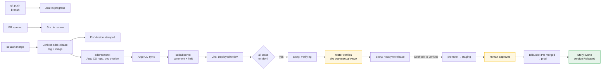

# Automation catalog

🇬🇧 English | [🇷🇺 Русский](./automation.ru.md)

Every trigger, every action, and where each one is implemented. If a status is
wrong, a Fix Version is missing or a card did not move, the answer is on this
page.

## The principle

> **Automate the transitions. Never automate the thinking.**

A machine should record that a branch was pushed, that an image reached
staging, that every task in a story is deployed. A machine should never decide
that a story is well-sized, that a contract is unambiguous, or that a scenario
was really verified. Those five decisions are the
[gates](./pipeline.md#gates-and-owners), and they stay human on purpose.

The test: **if a human's answer to the question is always the same, automate
it.** If it is sometimes "no", it is a gate.

## What a human still does

The whole list. Everything else on this page happens without anyone acting.

| Who | Action | Gate | Roughly |
|---|---|---|---|
| Team lead | size a story, label it, record the `change-id` | 1 | 5 min/story |
| Analytics | write `proposal.md` + `specs/*.md` | 2 | 1–3 h/story |
| Tester | review scenarios on the proposal PR | 3 | 20 min/story |
| Tech lead | approve and merge the proposal | 4 | 15 min/story |
| Developer | write `design.md` + `tasks.md` | 5 | 30 min/story |
| Developer | write the code, open the PR | 6 | the actual work |
| Developer | review a teammate's PR | 6 | 20 min/PR |
| Tester | verify scenarios, move one card | 9 | 30 min/story |
| Tech lead | approve the production promotion | 10 | 2 min/release |
| Analytics | merge the generated archive PR | 11 | 2 min/story |

Nobody types a version, edits a changelog, sets a Fix Version, moves a card
between `In progress` and `Verifying`, writes "deployed to dev" in a comment,
or maintains a release spreadsheet.

## Git and CI automation

Implemented as Jenkins pipelines. The pipelines themselves live in this repo's
`vars/` directory, which makes this repo a **Jenkins shared library** — each
application and Argo CD repo carries only a five-line `Jenkinsfile`. Fixing a
pipeline is one commit here, not a pull request in every repo.

| Trigger | Action | Where |
|---|---|---|
| Pull request opened or updated | validate conventional PR title | [`sddPrChecks`](../vars/sddPrChecks.groovy) |
| Pull request opened or updated | validate branch name against the SDD pattern | `sddPrChecks` |
| Pull request opened or updated | append missing Jira keys to the PR **description**, so they survive the squash | `sddPrChecks` |
| Pull request opened or updated | run the SDD metric check | `sddPrChecks` → [`check-sdd.sh`](../scripts/check-sdd.sh) |
| Any of the above finishing | post a build status Bitbucket can require as a merge check | `sddPrChecks` → `bb_build_status` |
| Push to `main` | compute the next version from conventional commits | [`sddRelease`](../vars/sddRelease.groovy) → [`release-version.sh`](../scripts/release-version.sh) |
| Push to `main` | fail if a published hotfix tag was never forward-ported | `sddRelease` |
| Push to `main` | build, scan, push the image; resolve its digest | `sddRelease` |
| Push to `main` | create the annotated tag and push it to Bitbucket | `sddRelease` |
| Push to `main` | create the Jira version, stamp Fix Versions, attach release notes | `sddRelease` → [`jira-release.sh`](../scripts/jira-release.sh) |
| Push to `main` | trigger the Argo CD repo's promote job for `dev` | `sddRelease` → `build job:` |
| Promote job, `dev` | write the `dev` overlay digest, push to `main` | [`sddPromote`](../vars/sddPromote.groovy) → [`promote.sh`](../scripts/promote.sh) |
| Promote job, `staging` | copy the `dev` digest to `staging`, push to `main` | `sddPromote` |
| Promote job, `prod` | open a Bitbucket pull request against the `prod` overlay, then stop | `sddPromote` → `bb_pr_create` |
| Push to the Argo CD repo's `main` | read the promotion trailers, wait for Argo | [`sddObserve`](../vars/sddObserve.groovy) |
| Argo reports Synced/Healthy | comment on Jira, set `Deployed Environments`, transition | `sddObserve` → [`jira-deploy.sh`](../scripts/jira-deploy.sh) |
| Argo reports Degraded | revert the overlay commit, comment the rollback | `sddObserve` |
| Prod deploy healthy | mark the Jira version Released | `sddObserve` → `jira-release.sh --release` |
| Weekly schedule | grouped dependency-bump pull requests | Renovate (self-hosted, Bitbucket platform) |
| Advisory published | security-bump PR, immediately | Renovate |

### The three Jenkins jobs per service

| Job | Type | Repo | Fires on |
|---|---|---|---|
| `<service>` | Multibranch | application | branch and PR events; `main` releases, everything else runs checks |
| `gitops/<service>-promote` | Pipeline, parameterised | Argo CD | upstream build, Jira webhook, or a human |
| `gitops/<service>-observe` | Multibranch (`main` only) | Argo CD | any push touching an overlay |

Splitting promote from observe is what makes the production path correct:
`sddPromote` stops at an open pull request, and `sddObserve` only starts once
somebody has merged it. Nothing ever waits on a sync a human has not approved.

### Wiring Bitbucket to Jenkins

Bitbucket Data Center has no equivalent of `on: push`. Two options, in order of
preference:

1. **Bitbucket Server Integration plugin** — Jenkins registers the webhooks
   itself when you point a job at a Bitbucket project/repo. Fewest moving
   parts, and it also posts build statuses back.
2. **A repository webhook** to `https://jenkins/…/bitbucket-scmsource-hook/notify`,
   configured per repo. Use this if the plugin is not installed.

Either way, set **Squash** as the repository's only merge strategy
(Repository settings → Merge strategies) or the version computation and the
Fix Version scan both degrade — see
[why](./release.md#commit-and-pr-conventions).

### The one exception the checks make

`renovate/*` branches are exempt from the branch-name and Jira-key rules
(Renovate is the only such bot here — Dependabot does not support Bitbucket
Data Center). Bots have no story, and
[chores are deliberately outside the SDD metric](./work-types.md#chore). This
is the only exemption; anything else that "needs an exemption" is work that
needs a Jira key.

## Jira automation rules

Fourteen rules. Each is a Jira automation rule in the project — trigger,
condition, action. Together they mean nobody drags a card.

### Board movement

| # | Trigger | Condition | Action |
|---|---|---|---|
| 1 | branch created (DevOps integration) | key resolves to a Task or Story | transition to `In progress`; assign to the branch author |
| 2 | pull request opened | — | transition to `In review` |
| 3 | pull request merged | issue is a Task | comment with the merge SHA |
| 4 | issue transitioned to `Deployed to dev` | — | (set by [`jira-deploy.sh`](../scripts/jira-deploy.sh)) |
| 5 | child issue transitioned | **all** children are `Deployed to dev` | transition the parent Story to `Verifying`; notify the QA assignee |
| 6 | Story transitioned to `Ready to release` | — | **send web request** → Jenkins `buildWithParameters` on `gitops/<service>-promote`, `TARGET_ENV=staging`, `SOURCE_ENV=dev` |
| 7 | `Deployed Environments` field changed | value contains `prod`, and all sibling tasks do too | transition the Story to `Done` |

Rule 6 is the hinge between the human gate and the machine: the tester moving
one card is what triggers the staging promotion. It is a "Send web request"
action posting to `repos/<org>/<gitops-repo>/dispatches` with a token stored in
the Jira automation secret store.

### Guardrails

| # | Trigger | Condition | Action |
|---|---|---|---|
| 8 | issue created | type is Story, no `SDD` label | comment: *"Stories need the SDD label and a change-id — see docs/work-types.md"*, and flag it for the team lead |
| 9 | issue transitioned to `Ready` | `change-id` field is empty | block the transition, comment why |
| 10 | issue transitioned to `In progress` | issue is a Story with children | revert: *"Stories roll up; move the Task instead"* |
| 11 | sprint started | any issue in the sprint is not `Ready` | comment on the sprint's issues, notify the team lead |

Rules 8–11 exist because every one of them describes a mistake that is cheap to
catch now and expensive to catch at gate 9.

### Lane-specific rules

| # | Trigger | Condition | Action |
|---|---|---|---|
| 12 | Incident created | — | auto-create three children: hotfix Bug, retro-spec Story, postmortem Task; link them; set the retro-spec due date to +2 working days |
| 13 | Spike created | title has no `[Nd]` timebox | comment asking for one; set the due date once it is there |
| 14 | Story labelled `feature-flag` reaches `Done` | — | create a *"remove the `<flag>` flag"* Task, due in two sprints, linked to the story |

Rule 12 is what makes the [hotfix lane](./work-types.md#hotfix) self-enforcing:
the retro-spec exists before anyone has stopped thinking about the outage, and
the incident cannot close while it is open.

Rule 14 is what stops feature flags from becoming permanent. It costs nothing
and it removes an entire category of tech debt.

## The board's data flow

The two yellow boxes are the only human actions in the entire delivery half.

## Configuration inventory

Everything the automation needs, in one place. Unlike per-repo workflow files,
Jenkins holds this centrally — set it once and every job inherits it.

### Jenkins global environment (Manage Jenkins → System → Global properties)

| Variable | Example | Used by |
|---|---|---|
| `SDD_WORKFLOW_REPO` | `ssh://git@bitbucket.acme.com/plat/workflow.git` | `sddScripts` — where the shared bash comes from |
| `SDD_JIRA_URL` | `https://jira.acme.com` | all Jira scripts |
| `SDD_JIRA_PROJECT` | `PROJ` | `jira-release.sh`, key lookup by Fix Version |
| `SDD_JIRA_EMAIL` | leave **unset** on Jira Server/DC; set it only on Jira Cloud | auth mode switch |
| `SDD_JIRA_FIELD_DEPLOYED_ENVS` | `customfield_10042` | `jira-deploy.sh` |
| `SDD_BITBUCKET_URL` | `https://bitbucket.acme.com` | `lib/bitbucket.sh` |
| `SDD_ARGOCD_SERVER` | `argocd.acme.com` | `sddObserve` health polling |
| `SDD_REGISTRY` | `registry.acme.com/platform` | default image destination |

### Jenkins plugins the pipelines require

The library uses a handful of steps that are not Jenkins core. Missing any of
them fails at *runtime*, in the middle of a release, with a `NoSuchMethodError`
that names the step but not the plugin — so check these before wiring anything
up.

| Step used | Plugin |
|---|---|
| `pipeline { }` | Pipeline: Declarative |
| `@Library` | Pipeline: Shared Groovy Libraries |
| `readJSON` | **Pipeline Utility Steps** — the one most often missing |
| `withCredentials` | Credentials Binding |
| `cleanWs` | Workspace Cleanup |
| `timestamps()` | Timestamper |
| `checkout([$class: 'GitSCM', …])` | Git |
| multibranch over Bitbucket, and build statuses | Bitbucket Server Integration |
| `writeFile`, `archiveArtifacts`, `build job:` | Pipeline core (Basic Steps, Build Step) |

The agents also need `git`, `curl`, `jq` and `yq` on `PATH`, and `docker` for
any repo using the default build.

### Jenkins credentials (Manage Jenkins → Credentials)

| ID | Kind | Scope |
|---|---|---|
| `sdd-jira-token` | Secret text | Jira PAT from a **bot account**: transition, edit, comment, manage versions |
| `sdd-bitbucket-token` | Secret text | Bitbucket HTTP access token: repo write on the app and Argo CD repos |
| `sdd-argocd-token` | Secret text | Argo CD token, read on applications |
| `sdd-registry` | Username/password | push access to the image registry |

The credential IDs are overridable per job — `sddRelease(jiraCredentials: '…')` —
but keeping the defaults means a new repo needs no credential wiring at all.

**Use a dedicated Jira bot account.** Automation running as a person means every
comment and Fix Version is attributed to them, their leaving breaks the
pipeline, and their permissions are broader than the automation needs.

### Jira custom fields to create

| Field | Type | Purpose |
|---|---|---|
| `Change ID` | short text | the OpenSpec `change-id`, mirrored from `.openspec.yaml` |
| `Deployed Environments` | short text | `dev,staging` — what JQL and board automation read |
| `Severity` | select: S1–S4 | routes bugs to the right lane |
| `Timebox` | number (days) | spikes |

Four fields. Resist adding more — every custom field is a thing someone must
fill in, and a field nobody fills in is worse than no field.

### Protecting the production overlay

Gate 10 is enforced by Bitbucket, not by trust. `sddPromote` lands `dev` and
`staging` directly on `main`, but opens a **pull request** for `prod` and
stops — so the approval is a review of a visible one-line diff, and Bitbucket
records who gave it.

Bitbucket Data Center has no `CODEOWNERS`. The equivalent is two settings on
the Argo CD repo:

- **Repository settings → Branch permissions** on `main`: *Prevent changes
  without a pull request*, and require **1 approver** from the tech-lead group.
- **Repository settings → Merge checks**: require the `sdd-pr-checks` build to
  be green, and require the minimum approvals above.

If you want the production gate to be per-path rather than per-repo, split the
Argo CD repo per service (which we do anyway — `gitops_backend`,
`gitops_frontend`) rather than trying to express path rules Bitbucket does not
have. **Default reviewers** (Repository settings → Default reviewers, scoped to
the `main` target branch) then puts the right people on every promotion PR
automatically, and `bb_pr_create` reads that configuration rather than
hard-coding names.

An alternative some Jenkins shops prefer: replace the pull request with an
`input` step in `sddPromote`, restricted with `submitter: 'tech-leads'`. It is
one fewer moving part, but you lose the reviewable diff, so we default to the
pull request.

## When automation breaks

It will. The failure modes, in the order you will actually hit them:

| Symptom | Cause | Fix |
|---|---|---|
| Fix Version missing on an issue | key absent from the squash commit | check the PR description; `sddPrChecks` should have appended it |
| Fix Version on the wrong issues | merge commits, not squash | Repository settings → Merge strategies → Squash only |
| Card stuck in `In review` | Jira ↔ Bitbucket link missing | check the Application Link, and that the DVCS accounts sync is running |
| Story stuck in `Verifying` | a child task's service never deployed | check that service's `…-observe` job |
| Deploy comment duplicated | the marker changed between runs | `jira-deploy.sh` keys on `[deploy:<service>:<env>]`; don't edit it |
| Version jumped a major | a `!` or `BREAKING CHANGE:` slipped into a chore | check the tag's message; retag deliberately |
| Nothing released after a merge | no conventional commits in range | expected — `chore(deps)` still bumps a patch, an empty range does not |
| Version computed as `0.0.1` every time | Jenkins cloned without tags | the checkout needs `CloneOption(shallow: false, noTags: false)`; `sddRelease` sets this |
| `sddScripts` fails on a new agent | `SDD_WORKFLOW_REPO` unset, or the agent cannot reach Bitbucket | it is global Jenkins env, not per-job |

**Rule: a broken automation is an incident, not a chore.** If the board stops
reflecting reality for a day, people start keeping status in their heads and in
Slack, and getting them back takes far longer than the fix did.

## Deliberately not automated

- **Sizing.** A machine cannot tell a big story from an Epic; that judgement is
  gate 1 and it is the highest-leverage human decision in the pipeline.
- **Scenario quality.** An LLM can draft scenarios; the tester decides whether
  the edges are covered. Auto-approving gate 3 removes the whole point of it.
- **Production timing.** The promotion is one click precisely so a human owns
  *when*. Continuous deployment to prod is a fine goal, but earn it with change
  failure rate first.
- **Archive.** The bot opens the archive PR; a person merges it, because
  archiving asserts the main specs now describe reality.
- **Estimates.** Historical-average estimation tools measure how consistently
  you guessed, not how big the work is.

## See also

| | |
|---|---|
| [Release](./release.md) | what the pipeline does and why |
| [Scrum layer](./scrum.md) | the board these rules drive |
| [Build guide](./build-guide.md) | the order to switch it all on |
