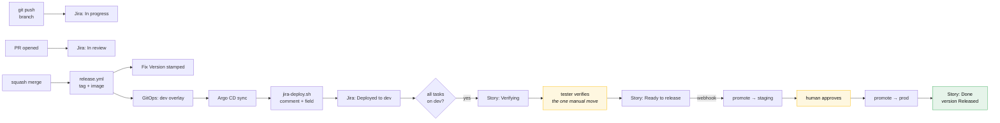

# Automation catalog

🇬🇧 English | [🇷🇺 Русский](./automation.ru.md)

Every trigger, every action, and where each one is implemented. If a status is
wrong, a Fix Version is missing or a card did not move, the answer is on this
page.

## The principle

> **Automate the transitions. Never automate the thinking.**

A machine should record that a branch was pushed, that an image reached
staging, that every task in a story is deployed. A machine should never decide
that a story is well-sized, that a contract is unambiguous, or that a scenario
was really verified. Those five decisions are the
[gates](./pipeline.md#gates-and-owners), and they stay human on purpose.

The test: **if a human's answer to the question is always the same, automate
it.** If it is sometimes "no", it is a gate.

## What a human still does

The whole list. Everything else on this page happens without anyone acting.

| Who | Action | Gate | Roughly |
|---|---|---|---|
| Team lead | size a story, label it, record the `change-id` | 1 | 5 min/story |
| Analytics | write `proposal.md` + `specs/*.md` | 2 | 1–3 h/story |
| Tester | review scenarios on the proposal PR | 3 | 20 min/story |
| Tech lead | approve and merge the proposal | 4 | 15 min/story |
| Developer | write `design.md` + `tasks.md` | 5 | 30 min/story |
| Developer | write the code, open the PR | 6 | the actual work |
| Developer | review a teammate's PR | 6 | 20 min/PR |
| Tester | verify scenarios, move one card | 9 | 30 min/story |
| Tech lead | approve the production promotion | 10 | 2 min/release |
| Analytics | merge the generated archive PR | 11 | 2 min/story |

Nobody types a version, edits a changelog, sets a Fix Version, moves a card
between `In progress` and `Verifying`, writes "deployed to dev" in a comment,
or maintains a release spreadsheet.

## Git and CI automation

Implemented as GitHub Actions in each application repo. All four files live in
this repo's `.github/workflows/` as templates; copy them in unchanged.

| Trigger | Action | File |
|---|---|---|
| PR opened or edited | validate conventional PR title | [`pr-conventions.yml`](../.github/workflows/pr-conventions.yml) |
| PR opened or edited | validate branch name against the SDD pattern | `pr-conventions.yml` |
| PR opened or edited | append missing Jira keys to the PR body, so they survive the squash | `pr-conventions.yml` |
| PR, and push to `main` | run the SDD metric check | [`sdd-check.yml`](../.github/workflows/sdd-check.yml) |
| Push to `main` | compute the next version from conventional commits | [`release.yml`](../.github/workflows/release.yml) → [`release-version.sh`](../scripts/release-version.sh) |
| Push to `main` | fail if a published hotfix tag was never forward-ported | `release.yml` |
| Push to `main` | build, scan, push the image by digest | `release.yml` |
| Push to `main` | create the annotated tag and the GitHub release notes | `release.yml` |
| Push to `main` | create the Jira version and stamp Fix Versions | `release.yml` → [`jira-release.sh`](../scripts/jira-release.sh) |
| Push to `main` | ask the GitOps repo to roll `dev` | `release.yml` |
| Dispatch `deploy` | write the `dev` overlay digest | [`deploy.yml`](../.github/workflows/deploy.yml) → [`promote.sh`](../scripts/promote.sh) |
| Dispatch `verified` | promote `dev` → `staging` | `deploy.yml` |
| Manual dispatch | open the `staging` → `prod` promotion PR | `deploy.yml` |
| Argo reports Healthy | comment on Jira, set `Deployed Environments`, transition | `deploy.yml` → [`jira-deploy.sh`](../scripts/jira-deploy.sh) |
| Argo reports Degraded | revert the overlay commit, comment the rollback | `deploy.yml` |
| Prod deploy healthy | mark the Jira version Released | `deploy.yml` |
| Weekly schedule | grouped dependency-bump PRs | Renovate |
| Advisory published | security-bump PR, immediately | Renovate |

### The one exception the checks make

`renovate/*` and `dependabot/*` branches are exempt from the branch-name and
Jira-key rules. Bots have no story, and
[chores are deliberately outside the SDD metric](./work-types.md#chore). This
is the only exemption; anything else that "needs an exemption" is work that
needs a Jira key.

## Jira automation rules

Fourteen rules. Each is a Jira automation rule in the project — trigger,
condition, action. Together they mean nobody drags a card.

### Board movement

| # | Trigger | Condition | Action |
|---|---|---|---|
| 1 | branch created (DevOps integration) | key resolves to a Task or Story | transition to `In progress`; assign to the branch author |
| 2 | pull request opened | — | transition to `In review` |
| 3 | pull request merged | issue is a Task | comment with the merge SHA |
| 4 | issue transitioned to `Deployed to dev` | — | (set by [`jira-deploy.sh`](../scripts/jira-deploy.sh)) |
| 5 | child issue transitioned | **all** children are `Deployed to dev` | transition the parent Story to `Verifying`; notify the QA assignee |
| 6 | Story transitioned to `Ready to release` | — | **send web request** → GitHub `repository_dispatch` type `verified` on the GitOps repo |
| 7 | `Deployed Environments` field changed | value contains `prod`, and all sibling tasks do too | transition the Story to `Done` |

Rule 6 is the hinge between the human gate and the machine: the tester moving
one card is what triggers the staging promotion. It is a "Send web request"
action posting to `repos/<org>/<gitops-repo>/dispatches` with a token stored in
the Jira automation secret store.

### Guardrails

| # | Trigger | Condition | Action |
|---|---|---|---|
| 8 | issue created | type is Story, no `SDD` label | comment: *"Stories need the SDD label and a change-id — see docs/work-types.md"*, and flag it for the team lead |
| 9 | issue transitioned to `Ready` | `change-id` field is empty | block the transition, comment why |
| 10 | issue transitioned to `In progress` | issue is a Story with children | revert: *"Stories roll up; move the Task instead"* |
| 11 | sprint started | any issue in the sprint is not `Ready` | comment on the sprint's issues, notify the team lead |

Rules 8–11 exist because every one of them describes a mistake that is cheap to
catch now and expensive to catch at gate 9.

### Lane-specific rules

| # | Trigger | Condition | Action |
|---|---|---|---|
| 12 | Incident created | — | auto-create three children: hotfix Bug, retro-spec Story, postmortem Task; link them; set the retro-spec due date to +2 working days |
| 13 | Spike created | title has no `[Nd]` timebox | comment asking for one; set the due date once it is there |
| 14 | Story labelled `feature-flag` reaches `Done` | — | create a *"remove the `<flag>` flag"* Task, due in two sprints, linked to the story |

Rule 12 is what makes the [hotfix lane](./work-types.md#hotfix) self-enforcing:
the retro-spec exists before anyone has stopped thinking about the outage, and
the incident cannot close while it is open.

Rule 14 is what stops feature flags from becoming permanent. It costs nothing
and it removes an entire category of tech debt.

## The board's data flow



The two yellow boxes are the only human actions in the entire delivery half.

## Configuration inventory

Everything the automation needs, in one place. Set these once per repo.

### Repository variables

| Variable | Example | Used by |
|---|---|---|
| `JIRA_URL` | `https://acme.atlassian.net` | all Jira scripts |
| `JIRA_PROJECT` | `PROJ` | `jira-release.sh` |
| `JIRA_EMAIL` | `bot@acme.com` — **Cloud only**, leave unset on Server/DC | auth mode switch |
| `JIRA_FIELD_DEPLOYED_ENVS` | `customfield_10042` | `jira-deploy.sh` |
| `GITOPS_REPO` | `acme/gitops_backend` | `release.yml` |
| `WORKFLOW_REPO` | `acme/workflow` | fetching the shared scripts |
| `ARGOCD_SERVER` | `argocd.internal` | `deploy.yml` |

### Secrets

| Secret | Scope | Used by |
|---|---|---|
| `JIRA_TOKEN` | Jira API token (Cloud) or PAT (DC), from a **bot account** | all Jira scripts |
| `GITOPS_TOKEN` | `repo` on the GitOps repos | `release.yml` dispatch |
| `WORKFLOW_TOKEN` | `read` on the workflow repo | script checkout |
| `ARGOCD_TOKEN` | read on Argo applications | `deploy.yml` health polling |

**Use a dedicated Jira bot account.** Automation running as a person means every
comment and Fix Version is attributed to them, their leaving breaks the
pipeline, and their permissions are broader than the automation needs.

### Jira custom fields to create

| Field | Type | Purpose |
|---|---|---|
| `Change ID` | short text | the OpenSpec `change-id`, mirrored from `.openspec.yaml` |
| `Deployed Environments` | short text | `dev,staging` — what JQL and board automation read |
| `Severity` | select: S1–S4 | routes bugs to the right lane |
| `Timebox` | number (days) | spikes |

Four fields. Resist adding more — every custom field is a thing someone must
fill in, and a field nobody fills in is worse than no field.

### Protecting the production overlay

Gate 10 is enforced by branch protection on the GitOps repo, not by trust.
`deploy.yml` lands `dev` and `staging` directly on `main`, but opens a **pull
request** for `prod` and stops — so the approval is a review of a visible
one-line diff, and it is recorded.

`CODEOWNERS` in each GitOps repo:

```
apps/*/overlays/prod/**    @your-org/tech-leads
```

plus branch protection on `main` requiring code-owner review for those paths.
That combination is what makes the production approval an audited event rather
than a merge someone eyeballed, and it is why `promote.sh --pr` refuses to
bundle anything other than a digest into the change.

## When automation breaks

It will. The failure modes, in the order you will actually hit them:

| Symptom | Cause | Fix |
|---|---|---|
| Fix Version missing on an issue | key absent from the squash commit | check the PR body; `pr-conventions.yml` should have appended it |
| Fix Version on the wrong issues | merge commits, not squash | set the repo to squash-merge only |
| Card stuck in `In review` | Jira DevOps integration not linked to the repo | re-link in Jira → Settings → Applications |
| Story stuck in `Verifying` | a child task's service never deployed | check `deploy.yml` for that service |
| Deploy comment duplicated | the marker changed between runs | `jira-deploy.sh` keys on `[deploy:<service>:<env>]`; don't edit it |
| Version jumped a major | a `!` or `BREAKING CHANGE:` slipped into a chore | check the tag's message; retag deliberately |
| Nothing released after a merge | no conventional commits in range | expected — `chore(deps)` still bumps a patch, an empty range does not |

**Rule: a broken automation is an incident, not a chore.** If the board stops
reflecting reality for a day, people start keeping status in their heads and in
Slack, and getting them back takes far longer than the fix did.

## Deliberately not automated

- **Sizing.** A machine cannot tell a big story from an Epic; that judgement is
  gate 1 and it is the highest-leverage human decision in the pipeline.
- **Scenario quality.** An LLM can draft scenarios; the tester decides whether
  the edges are covered. Auto-approving gate 3 removes the whole point of it.
- **Production timing.** The promotion is one click precisely so a human owns
  *when*. Continuous deployment to prod is a fine goal, but earn it with change
  failure rate first.
- **Archive.** The bot opens the archive PR; a person merges it, because
  archiving asserts the main specs now describe reality.
- **Estimates.** Historical-average estimation tools measure how consistently
  you guessed, not how big the work is.

## See also

| | |
|---|---|
| [Release](./release.md) | what the pipeline does and why |
| [Scrum layer](./scrum.md) | the board these rules drive |
| [Build guide](./build-guide.md) | the order to switch it all on |
