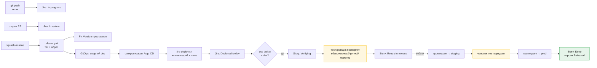

# Каталог автоматизации

[🇬🇧 English](./automation.md) | 🇷🇺 Русский

Каждый триггер, каждое действие и где что реализовано. Если статус неверен,
Fix Version отсутствует или карточка не поехала — ответ на этой странице.

## Принцип

> **Автоматизируйте переходы. Никогда не автоматизируйте мышление.**

Машина должна фиксировать, что ветка запушена, что образ доехал до staging, что
все task'и story выкачены. Машина никогда не должна решать, что story хорошо
нарезана, что контракт однозначен или что сценарий действительно проверен. Это
пять [шлюзов](./pipeline.ru.md#шлюзы-и-владельцы), и они намеренно остаются
человеческими.

Проверка: **если ответ человека на вопрос всегда один и тот же —
автоматизируйте.** Если иногда «нет» — это шлюз.

## Что человек всё ещё делает

Весь список. Всё остальное на этой странице происходит без чьих-либо действий.

| Кто | Действие | Шлюз | Примерно |
|---|---|---|---|
| Тимлид | нарезать story, поставить метку, записать `change-id` | 1 | 5 мин/story |
| Аналитик | написать `proposal.md` + `specs/*.md` | 2 | 1–3 ч/story |
| Тестировщик | отревьюить сценарии в PR с proposal | 3 | 20 мин/story |
| Техлид | утвердить и влить proposal | 4 | 15 мин/story |
| Разработчик | написать `design.md` + `tasks.md` | 5 | 30 мин/story |
| Разработчик | написать код, открыть PR | 6 | собственно работа |
| Разработчик | отревьюить PR коллеги | 6 | 20 мин/PR |
| Тестировщик | проверить сценарии, передвинуть одну карточку | 9 | 30 мин/story |
| Техлид | утвердить промоушен в прод | 10 | 2 мин/релиз |
| Аналитик | влить сгенерированный PR архивации | 11 | 2 мин/story |

Никто не набирает версию, не правит changelog, не проставляет Fix Version, не
двигает карточку между `In progress` и `Verifying`, не пишет «выкачено в dev» в
комментарии и не ведёт релизную таблицу.

## Автоматизация git и CI

Реализована как GitHub Actions в каждом репозитории приложения. Все четыре
файла лежат в `.github/workflows/` этого репозитория как шаблоны; копируйте
как есть.

| Триггер | Действие | Файл |
|---|---|---|
| PR открыт или отредактирован | проверить conventional-заголовок PR | [`pr-conventions.yml`](../.github/workflows/pr-conventions.yml) |
| PR открыт или отредактирован | проверить имя ветки по шаблону SDD | `pr-conventions.yml` |
| PR открыт или отредактирован | дописать недостающие ключи Jira в тело PR, чтобы они пережили squash | `pr-conventions.yml` |
| PR и пуш в `main` | прогнать проверку метрики SDD | [`sdd-check.yml`](../.github/workflows/sdd-check.yml) |
| Пуш в `main` | вычислить версию из conventional commits | [`release.yml`](../.github/workflows/release.yml) → [`release-version.sh`](../scripts/release-version.sh) |
| Пуш в `main` | уронить сборку, если опубликованный хотфикс-тег не форвард-портнут | `release.yml` |
| Пуш в `main` | собрать, просканировать, запушить образ по digest | `release.yml` |
| Пуш в `main` | создать аннотированный тег и GitHub release notes | `release.yml` |
| Пуш в `main` | создать версию Jira и проставить Fix Version | `release.yml` → [`jira-release.sh`](../scripts/jira-release.sh) |
| Пуш в `main` | попросить GitOps выкатить `dev` | `release.yml` |
| Диспатч `deploy` | записать digest в оверлей `dev` | [`deploy.yml`](../.github/workflows/deploy.yml) → [`promote.sh`](../scripts/promote.sh) |
| Диспатч `verified` | промоутить `dev` → `staging` | `deploy.yml` |
| Ручной диспатч | открыть PR промоушена `staging` → `prod` | `deploy.yml` |
| Argo сообщил Healthy | комментарий в Jira, поле `Deployed Environments`, переход | `deploy.yml` → [`jira-deploy.sh`](../scripts/jira-deploy.sh) |
| Argo сообщил Degraded | откатить коммит оверлея, прокомментировать откат | `deploy.yml` |
| Выкатка в прод здорова | пометить версию Jira как Released | `deploy.yml` |
| Еженедельно по расписанию | PR с бампами зависимостей пачкой | Renovate |
| Опубликована уязвимость | PR с патчем безопасности немедленно | Renovate |

### Единственное исключение в проверках

Ветки `renovate/*` и `dependabot/*` освобождены от правил имени ветки и ключа
Jira. У ботов нет story, а [рутина намеренно вне метрики
SDD](./work-types.ru.md#рутина). Это единственное исключение; всё остальное,
чему «нужно исключение», — это работа, которой нужен ключ Jira.

## Правила автоматизации Jira

Четырнадцать правил. Каждое — правило автоматизации в проекте: триггер, условие,
действие. Вместе они означают, что карточки никто не таскает.

### Движение по доске

| № | Триггер | Условие | Действие |
|---|---|---|---|
| 1 | создана ветка (интеграция DevOps) | ключ резолвится в Task или Story | перевести в `In progress`, назначить на автора ветки |
| 2 | открыт pull request | — | перевести в `In review` |
| 3 | pull request влит | задача — Task | комментарий с SHA влития |
| 4 | задача переведена в `Deployed to dev` | — | (ставит [`jira-deploy.sh`](../scripts/jira-deploy.sh)) |
| 5 | переведён потомок | **все** потомки в `Deployed to dev` | перевести родительскую Story в `Verifying`, уведомить QA |
| 6 | Story переведена в `Ready to release` | — | **отправить веб-запрос** → `repository_dispatch` типа `verified` в GitOps-репозиторий |
| 7 | изменилось поле `Deployed Environments` | значение содержит `prod`, и у всех соседних task'ов тоже | перевести Story в `Done` |

Правило 6 — шарнир между человеческим шлюзом и машиной: перенос тестировщиком
одной карточки запускает промоушен в staging. Это действие «Send web request»,
постящее в `repos/<org>/<gitops-repo>/dispatches` с токеном из хранилища
секретов автоматизации Jira.

### Ограждения

| № | Триггер | Условие | Действие |
|---|---|---|---|
| 8 | задача создана | тип Story, метки `SDD` нет | комментарий: *«Story нужна метка SDD и change-id — см. docs/work-types.ru.md»*, флаг тимлиду |
| 9 | задача переведена в `Ready` | поле `change-id` пусто | заблокировать переход, объяснить в комментарии |
| 10 | задача переведена в `In progress` | это Story с потомками | откатить: *«Story роллапится; двигайте Task»* |
| 11 | спринт стартовал | какая-то задача в спринте не `Ready` | комментарий по задачам спринта, уведомить тимлида |

Правила 8–11 существуют потому, что каждое описывает ошибку, которую сейчас
поймать дёшево, а на шлюзе 9 — дорого.

### Правила по полосам

| № | Триггер | Условие | Действие |
|---|---|---|---|
| 12 | создан Incident | — | автосоздать трёх потомков: Bug-хотфикс, Story ретро-спеки, Task постмортема; связать; срок ретро-спеки +2 рабочих дня |
| 13 | создан Spike | в заголовке нет таймбокса `[Nd]` | комментарий с просьбой указать; после этого проставить срок |
| 14 | Story с меткой `feature-flag` дошла до `Done` | — | создать Task *«снять флаг `<flag>`»* со сроком в два спринта, связать со story |

Правило 12 делает [полосу хотфикса](./work-types.ru.md#хотфикс)
самопринуждающей: ретро-спека существует раньше, чем кто-то перестал думать об
аварии, и авария не может закрыться, пока она открыта.

Правило 14 не даёт feature-флагам стать вечными. Оно ничего не стоит и убирает
целый класс техдолга.

## Поток данных доски



Два жёлтых блока — единственные человеческие действия во всей доставляющей
половине.

## Инвентарь конфигурации

Всё, что нужно автоматизации, в одном месте. Настраивается один раз на
репозиторий.

### Переменные репозитория

| Переменная | Пример | Кем используется |
|---|---|---|
| `JIRA_URL` | `https://acme.atlassian.net` | все скрипты Jira |
| `JIRA_PROJECT` | `PROJ` | `jira-release.sh` |
| `JIRA_EMAIL` | `bot@acme.com` — **только Cloud**, для Server/DC не задавать | переключение режима аутентификации |
| `JIRA_FIELD_DEPLOYED_ENVS` | `customfield_10042` | `jira-deploy.sh` |
| `GITOPS_REPO` | `acme/gitops_backend` | `release.yml` |
| `WORKFLOW_REPO` | `acme/workflow` | получение общих скриптов |
| `ARGOCD_SERVER` | `argocd.internal` | `deploy.yml` |

### Секреты

| Секрет | Область | Кем используется |
|---|---|---|
| `JIRA_TOKEN` | API-токен (Cloud) или PAT (DC), от **бот-аккаунта** | все скрипты Jira |
| `GITOPS_TOKEN` | `repo` на GitOps-репозитории | диспатч в `release.yml` |
| `WORKFLOW_TOKEN` | чтение репозитория workflow | чекаут скриптов |
| `ARGOCD_TOKEN` | чтение приложений Argo | опрос здоровья в `deploy.yml` |

**Используйте выделенный бот-аккаунт Jira.** Автоматизация от имени человека
означает, что каждый комментарий и каждый Fix Version приписаны ему, его уход
ломает пайплайн, а прав у него больше, чем нужно автоматизации.

### Кастомные поля Jira, которые нужно создать

| Поле | Тип | Зачем |
|---|---|---|
| `Change ID` | короткий текст | `change-id` OpenSpec, зеркалит `.openspec.yaml` |
| `Deployed Environments` | короткий текст | `dev,staging` — это читают JQL и автоматизация доски |
| `Severity` | список: S1–S4 | маршрутизирует баги по полосам |
| `Timebox` | число (дни) | спайки |

Четыре поля. Сопротивляйтесь добавлению новых: каждое кастомное поле — это то,
что кто-то должен заполнять, а поле, которое никто не заполняет, хуже, чем
отсутствие поля.

### Защита продового оверлея

Шлюз 10 обеспечивается branch protection в GitOps-репозитории, а не доверием.
`deploy.yml` кладёт `dev` и `staging` прямо в `main`, но для `prod` открывает
**pull request** и останавливается — так что подтверждение это ревью видимого
однострочного дифа, и оно фиксируется.

`CODEOWNERS` в каждом GitOps-репозитории:

```
apps/*/overlays/prod/**    @your-org/tech-leads
```

плюс branch protection на `main`, требующий ревью владельца кода для этих
путей. Эта комбинация делает подтверждение выкатки в прод аудируемым событием,
а не PR, на который кто-то посмотрел, — и поэтому `promote.sh --pr`
отказывается заворачивать в изменение что-либо, кроме digest.

## Когда автоматизация ломается

Она сломается. Режимы отказа в том порядке, в котором вы с ними реально
столкнётесь:

| Симптом | Причина | Починка |
|---|---|---|
| Fix Version отсутствует у задачи | ключ отсутствует в squash-коммите | проверьте тело PR; `pr-conventions.yml` должен был его дописать |
| Fix Version у не тех задач | merge-коммиты вместо squash | включите в репозитории только squash-влитие |
| Карточка застряла в `In review` | интеграция Jira DevOps не связана с репозиторием | пересвяжите в Jira → Settings → Applications |
| Story застряла в `Verifying` | сервис одного из потомков так и не выкатился | смотрите `deploy.yml` этого сервиса |
| Комментарий о выкатке продублирован | маркер изменился между прогонами | `jira-deploy.sh` опирается на `[deploy:<service>:<env>]`; не правьте его |
| Версия прыгнула через major | `!` или `BREAKING CHANGE:` просочилось в рутинный коммит | проверьте сообщение тега; перетегируйте осознанно |
| После влития ничего не зарелизилось | в диапазоне нет conventional-коммитов | ожидаемо — `chore(deps)` даёт patch, пустой диапазон не даёт ничего |

**Правило: сломанная автоматизация — авария, а не рутина.** Если доска на день
перестала отражать реальность, люди начинают держать статус в голове и в Slack,
и вернуть их обратно стоит куда дольше, чем починка.

## Намеренно не автоматизировано

- **Нарезка.** Машина не отличит большую story от Epic'а; это суждение — шлюз 1
  и самое рычажное человеческое решение в пайплайне.
- **Качество сценариев.** LLM может набросать сценарии; решает, покрыты ли края,
  тестировщик. Автоподтверждение шлюза 3 убирает весь его смысл.
- **Тайминг прода.** Промоушен сделан одним нажатием именно затем, чтобы
  *когда* решал человек. Непрерывная выкатка в прод — хорошая цель, но её надо
  заслужить долей неудачных изменений.
- **Архивация.** Бот открывает PR архивации; вливает человек, потому что
  архивация утверждает, что основные спецификации теперь описывают реальность.
- **Оценки.** Инструменты оценки по историческому среднему измеряют, насколько
  последовательно вы угадывали, а не насколько велика работа.

## Смотрите также

| | |
|---|---|
| [Релиз](./release.ru.md) | что делает пайплайн и почему |
| [Scrum-слой](./scrum.ru.md) | доска, которой управляют эти правила |
| [Руководство по сборке](./build-guide.ru.md) | в каком порядке всё это включать |
