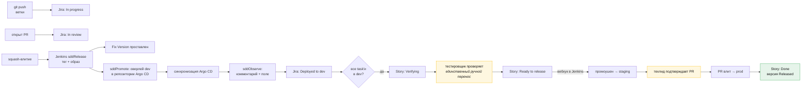

# Каталог автоматизации

[🇬🇧 English](./automation.md) | 🇷🇺 Русский

Каждый триггер, каждое действие и где что реализовано. Если статус неверен,
Fix Version отсутствует или карточка не поехала — ответ на этой странице.

## Принцип

> **Автоматизируйте переходы. Никогда не автоматизируйте мышление.**

Машина должна фиксировать, что ветка запушена, что образ доехал до staging, что
все task'и story выкачены. Машина никогда не должна решать, что story хорошо
нарезана, что контракт однозначен или что сценарий действительно проверен. Это
пять [шлюзов](./pipeline.ru.md#шлюзы-и-владельцы), и они намеренно остаются
человеческими.

Проверка: **если ответ человека на вопрос всегда один и тот же —
автоматизируйте.** Если иногда «нет» — это шлюз.

## Что человек всё ещё делает

Весь список. Всё остальное на этой странице происходит без чьих-либо действий.

| Кто | Действие | Шлюз | Примерно |
|---|---|---|---|
| Тимлид | нарезать story, поставить метку, записать `change-id` | 1 | 5 мин/story |
| Аналитик | написать `proposal.md` + `specs/*.md` | 2 | 1–3 ч/story |
| Тестировщик | отревьюить сценарии в PR с proposal | 3 | 20 мин/story |
| Техлид | утвердить и влить proposal | 4 | 15 мин/story |
| Разработчик | написать `design.md` + `tasks.md` | 5 | 30 мин/story |
| Разработчик | написать код, открыть PR | 6 | собственно работа |
| Разработчик | отревьюить PR коллеги | 6 | 20 мин/PR |
| Тестировщик | проверить сценарии, передвинуть одну карточку | 9 | 30 мин/story |
| Техлид | утвердить промоушен в прод | 10 | 2 мин/релиз |
| Аналитик | влить сгенерированный PR архивации | 11 | 2 мин/story |

Никто не набирает версию, не правит changelog, не проставляет Fix Version, не
двигает карточку между `In progress` и `Verifying`, не пишет «выкачено в dev» в
комментарии и не ведёт релизную таблицу.

## Автоматизация git и CI

Реализована пайплайнами Jenkins. Сами пайплайны лежат в каталоге `vars/` этого
репозитория, что делает его **общей библиотекой Jenkins** — в каждом
репозитории приложения и Argo CD лежит только `Jenkinsfile` на пять строк.
Починка пайплайна — это один коммит здесь, а не pull request в каждом
репозитории.

| Триггер | Действие | Где |
|---|---|---|
| PR открыт или обновлён | проверить conventional-заголовок PR | [`sddPrChecks`](../vars/sddPrChecks.groovy) |
| PR открыт или обновлён | проверить имя ветки по шаблону SDD | `sddPrChecks` |
| PR открыт или обновлён | дописать недостающие ключи Jira в **описание** PR, чтобы они пережили squash | `sddPrChecks` |
| PR открыт или обновлён | прогнать проверку метрики SDD | `sddPrChecks` → [`check-sdd.sh`](../scripts/check-sdd.sh) |
| Любая из проверок завершилась | отправить build status, который Bitbucket может требовать как merge check | `sddPrChecks` → `bb_build_status` |
| Пуш в `main` | вычислить версию из conventional commits | [`sddRelease`](../vars/sddRelease.groovy) → [`release-version.sh`](../scripts/release-version.sh) |
| Пуш в `main` | уронить сборку, если опубликованный хотфикс-тег не форвард-портнут | `sddRelease` |
| Пуш в `main` | собрать, просканировать, запушить образ; получить digest | `sddRelease` |
| Пуш в `main` | создать аннотированный тег и отправить его в Bitbucket | `sddRelease` |
| Пуш в `main` | создать версию Jira, проставить Fix Version, приложить release notes | `sddRelease` → [`jira-release.sh`](../scripts/jira-release.sh) |
| Пуш в `main` | запустить promote-джобу репозитория Argo CD для `dev` | `sddRelease` → `build job:` |
| Promote-джоба, `dev` | записать digest в оверлей `dev`, запушить в `main` | [`sddPromote`](../vars/sddPromote.groovy) → [`promote.sh`](../scripts/promote.sh) |
| Promote-джоба, `staging` | скопировать digest из `dev` в `staging`, запушить в `main` | `sddPromote` |
| Promote-джоба, `prod` | открыть pull request в Bitbucket против оверлея `prod` и остановиться | `sddPromote` → `bb_pr_create` |
| Пуш в `main` репозитория Argo CD | прочитать трейлеры промоушена, ждать Argo | [`sddObserve`](../vars/sddObserve.groovy) |
| Argo сообщил Synced/Healthy | комментарий в Jira, поле `Deployed Environments`, переход | `sddObserve` → [`jira-deploy.sh`](../scripts/jira-deploy.sh) |
| Argo сообщил Degraded | откатить коммит оверлея, прокомментировать откат | `sddObserve` |
| Выкатка в прод здорова | пометить версию Jira как Released | `sddObserve` → `jira-release.sh --release` |
| Еженедельно по расписанию | PR с бампами зависимостей пачкой | Renovate (self-hosted, платформа Bitbucket) |
| Опубликована уязвимость | PR с патчем безопасности немедленно | Renovate |

### Три джобы Jenkins на сервис

| Джоба | Тип | Репозиторий | Срабатывает на |
|---|---|---|---|
| `<service>` | Multibranch | приложения | событиях веток и PR; `main` релизит, остальное прогоняет проверки |
| `gitops/<service>-promote` | Pipeline с параметрами | Argo CD | вышестоящей сборке, вебхуке Jira или человеке |
| `gitops/<service>-observe` | Multibranch (только `main`) | Argo CD | любом пуше, трогающем оверлей |

Разделение promote и observe — то, что делает продовый путь корректным:
`sddPromote` останавливается на открытом pull request, а `sddObserve`
стартует, только когда его кто-то влил. Ничто никогда не ждёт синхронизации,
которую человек ещё не подтвердил.

### Как связать Bitbucket с Jenkins

В Bitbucket Data Center нет аналога `on: push`. Два способа, по убыванию
предпочтительности:

1. **Плагин Bitbucket Server Integration** — Jenkins сам регистрирует вебхуки,
   когда джоба указывает на проект/репозиторий Bitbucket. Меньше всего
   движущихся частей, и он же отправляет build statuses обратно.
2. **Вебхук репозитория** на `https://jenkins/…/bitbucket-scmsource-hook/notify`,
   настраиваемый на каждый репозиторий. Используйте, если плагин не установлен.

В любом случае поставьте **Squash** единственной стратегией влития
(Repository settings → Merge strategies), иначе деградируют и вычисление
версии, и сканирование для Fix Version — см.
[почему](./release.ru.md#конвенции-коммитов-и-pr).

### Единственное исключение в проверках

Ветки `renovate/*` освобождены от правил имени ветки и ключа Jira (Renovate
здесь единственный такой бот — Dependabot не умеет Bitbucket Data Center). У
ботов нет story, а [рутина намеренно вне метрики
SDD](./work-types.ru.md#рутина). Это единственное исключение; всё остальное,
чему «нужно исключение», — это работа, которой нужен ключ Jira.

## Правила автоматизации Jira

Четырнадцать правил. Каждое — правило автоматизации в проекте: триггер, условие,
действие. Вместе они означают, что карточки никто не таскает.

### Движение по доске

| № | Триггер | Условие | Действие |
|---|---|---|---|
| 1 | создана ветка (интеграция DevOps) | ключ резолвится в Task или Story | перевести в `In progress`, назначить на автора ветки |
| 2 | открыт pull request | — | перевести в `In review` |
| 3 | pull request влит | задача — Task | комментарий с SHA влития |
| 4 | задача переведена в `Deployed to dev` | — | (ставит [`jira-deploy.sh`](../scripts/jira-deploy.sh)) |
| 5 | переведён потомок | **все** потомки в `Deployed to dev` | перевести родительскую Story в `Verifying`, уведомить QA |
| 6 | Story переведена в `Ready to release` | — | **отправить веб-запрос** → `buildWithParameters` Jenkins на `gitops/<service>-promote`, `TARGET_ENV=staging`, `SOURCE_ENV=dev` |
| 7 | изменилось поле `Deployed Environments` | значение содержит `prod`, и у всех соседних task'ов тоже | перевести Story в `Done` |

Правило 6 — шарнир между человеческим шлюзом и машиной: перенос тестировщиком
одной карточки запускает промоушен в staging. Это действие «Send web request»,
постящее в

```
POST https://jenkins/job/gitops/job/<service>-promote/buildWithParameters
     ?SERVICE=<service>&VERSION=<version>&TARGET_ENV=staging&SOURCE_ENV=dev
```

с API-токеном Jenkins из хранилища секретов автоматизации Jira; джоба должна
разрешать удалённый запуск.

### Ограждения

| № | Триггер | Условие | Действие |
|---|---|---|---|
| 8 | задача создана | тип Story, метки `SDD` нет | комментарий: *«Story нужна метка SDD и change-id — см. docs/work-types.ru.md»*, флаг тимлиду |
| 9 | задача переведена в `Ready` | поле `change-id` пусто | заблокировать переход, объяснить в комментарии |
| 10 | задача переведена в `In progress` | это Story с потомками | откатить: *«Story роллапится; двигайте Task»* |
| 11 | спринт стартовал | какая-то задача в спринте не `Ready` | комментарий по задачам спринта, уведомить тимлида |

Правила 8–11 существуют потому, что каждое описывает ошибку, которую сейчас
поймать дёшево, а на шлюзе 9 — дорого.

### Правила по полосам

| № | Триггер | Условие | Действие |
|---|---|---|---|
| 12 | создан Incident | — | автосоздать трёх потомков: Bug-хотфикс, Story ретро-спеки, Task постмортема; связать; срок ретро-спеки +2 рабочих дня |
| 13 | создан Spike | в заголовке нет таймбокса `[Nd]` | комментарий с просьбой указать; после этого проставить срок |
| 14 | Story с меткой `feature-flag` дошла до `Done` | — | создать Task *«снять флаг `<flag>`»* со сроком в два спринта, связать со story |

Правило 12 делает [полосу хотфикса](./work-types.ru.md#хотфикс)
самопринуждающей: ретро-спека существует раньше, чем кто-то перестал думать об
аварии, и авария не может закрыться, пока она открыта.

Правило 14 не даёт feature-флагам стать вечными. Оно ничего не стоит и убирает
целый класс техдолга.

## Поток данных доски



Два жёлтых блока — единственные человеческие действия во всей доставляющей
половине.

## Инвентарь конфигурации

Всё, что нужно автоматизации, в одном месте. В отличие от workflow-файлов по
репозиториям, Jenkins хранит это централизованно — настраивается один раз, и
каждая джоба это наследует.

### Глобальное окружение Jenkins (Manage Jenkins → System → Global properties)

| Переменная | Пример | Кем используется |
|---|---|---|
| `SDD_WORKFLOW_REPO` | `ssh://git@bitbucket.acme.com/plat/workflow.git` | `sddScripts` — откуда берётся общий bash |
| `SDD_JIRA_URL` | `https://jira.acme.com` | все скрипты Jira |
| `SDD_JIRA_PROJECT` | `PROJ` | `jira-release.sh`, поиск ключей по Fix Version |
| `SDD_JIRA_EMAIL` | на Jira Server/DC **не задавать**; только для Jira Cloud | переключение режима аутентификации |
| `SDD_JIRA_FIELD_DEPLOYED_ENVS` | `customfield_10042` | `jira-deploy.sh` |
| `SDD_BITBUCKET_URL` | `https://bitbucket.acme.com` | `lib/bitbucket.sh` |
| `SDD_ARGOCD_SERVER` | `argocd.acme.com` | опрос здоровья в `sddObserve` |
| `SDD_REGISTRY` | `registry.acme.com/platform` | реестр образов по умолчанию |

### Плагины Jenkins, нужные пайплайнам

Библиотека использует несколько шагов, которых нет в ядре Jenkins. Отсутствие
любого из них ломает сборку *в рантайме*, посреди релиза, с `NoSuchMethodError`,
который называет шаг, но не плагин, — поэтому проверьте их до того, как
что-либо подключать.

| Используемый шаг | Плагин |
|---|---|
| `pipeline { }` | Pipeline: Declarative |
| `@Library` | Pipeline: Shared Groovy Libraries |
| `readJSON` | **Pipeline Utility Steps** — чаще всего именно его и нет |
| `withCredentials` | Credentials Binding |
| `cleanWs` | Workspace Cleanup |
| `timestamps()` | Timestamper |
| `checkout([$class: 'GitSCM', …])` | Git |
| multibranch по Bitbucket и build statuses | Bitbucket Server Integration |
| `writeFile`, `archiveArtifacts`, `build job:` | ядро Pipeline (Basic Steps, Build Step) |

На агентах также должны быть `git`, `curl`, `jq` и `yq` в `PATH`, а для
репозиториев со сборкой по умолчанию — `docker`.

### Учётные данные Jenkins (Manage Jenkins → Credentials)

| ID | Тип | Права |
|---|---|---|
| `sdd-jira-token` | Secret text | PAT Jira от **бот-аккаунта**: переходы, редактирование, комментарии, управление версиями |
| `sdd-bitbucket-token` | Secret text | HTTP access token Bitbucket: запись в репозитории приложения и Argo CD |
| `sdd-argocd-token` | Secret text | токен Argo CD, чтение приложений |
| `sdd-registry` | Username/password | пуш в реестр образов |

ID учётных данных переопределяются на джобу — `sddRelease(jiraCredentials: '…')` —
но с дефолтами новому репозиторию не нужна вообще никакая настройка секретов.

**Используйте выделенный бот-аккаунт Jira.** Автоматизация от имени человека
означает, что каждый комментарий и каждый Fix Version приписаны ему, его уход
ломает пайплайн, а прав у него больше, чем нужно автоматизации.

### Кастомные поля Jira, которые нужно создать

| Поле | Тип | Зачем |
|---|---|---|
| `Change ID` | короткий текст | `change-id` OpenSpec, зеркалит `.openspec.yaml` |
| `Deployed Environments` | короткий текст | `dev,staging` — это читают JQL и автоматизация доски |
| `Severity` | список: S1–S4 | маршрутизирует баги по полосам |
| `Timebox` | число (дни) | спайки |

Четыре поля. Сопротивляйтесь добавлению новых: каждое кастомное поле — это то,
что кто-то должен заполнять, а поле, которое никто не заполняет, хуже, чем
отсутствие поля.

### Защита продового оверлея

Шлюз 10 обеспечивает Bitbucket, а не доверие. `sddPromote` кладёт `dev` и
`staging` прямо в `main`, но для `prod` открывает **pull request** и
останавливается — так что подтверждение это ревью видимого однострочного дифа,
и Bitbucket фиксирует, кто его дал.

В Bitbucket Data Center нет `CODEOWNERS`. Эквивалент — две настройки
репозитория Argo CD:

- **Repository settings → Branch permissions** на `main`: *Prevent changes
  without a pull request* и требование **1 подтверждения** от группы техлидов.
- **Repository settings → Merge checks**: требовать зелёную сборку
  `sdd-pr-checks` и минимальное число подтверждений выше.

Если нужен продовый шлюз по путям, а не по репозиторию, — разделяйте
репозиторий Argo CD по сервисам (мы так и делаем: `gitops_backend`,
`gitops_frontend`), а не пытайтесь выразить правила путей, которых в Bitbucket
нет. **Default reviewers** (Repository settings → Default reviewers, с целевой
веткой `main`) затем автоматически ставит нужных людей на каждый PR
промоушена, а `bb_pr_create` читает эту конфигурацию, вместо того чтобы
зашивать имена.

Альтернатива, которую предпочитают некоторые Jenkins-команды: заменить pull
request шагом `input` в `sddPromote` с ограничением `submitter: 'tech-leads'`.
Это на одну движущуюся часть меньше, но теряется читаемый диф, поэтому по
умолчанию у нас pull request.

## Когда автоматизация ломается

Она сломается. Режимы отказа в том порядке, в котором вы с ними реально
столкнётесь:

| Симптом | Причина | Починка |
|---|---|---|
| Fix Version отсутствует у задачи | ключ отсутствует в squash-коммите | проверьте описание PR; `sddPrChecks` должен был его дописать |
| Fix Version у не тех задач | merge-коммиты вместо squash | Repository settings → Merge strategies → только Squash |
| Карточка застряла в `In review` | нет связи Jira ↔ Bitbucket | проверьте Application Link и что синхронизация DVCS работает |
| Story застряла в `Verifying` | сервис одного из потомков так и не выкатился | смотрите джобу `…-observe` этого сервиса |
| Комментарий о выкатке продублирован | маркер изменился между прогонами | `jira-deploy.sh` опирается на `[deploy:<service>:<env>]`; не правьте его |
| Версия прыгнула через major | `!` или `BREAKING CHANGE:` просочилось в рутинный коммит | проверьте сообщение тега; перетегируйте осознанно |
| После влития ничего не зарелизилось | в диапазоне нет conventional-коммитов | ожидаемо — `chore(deps)` даёт patch, пустой диапазон не даёт ничего |
| Версия каждый раз `0.0.1` | Jenkins склонировал без тегов | чекауту нужен `CloneOption(shallow: false, noTags: false)`; `sddRelease` это ставит |
| `sddScripts` падает на новом агенте | не задан `SDD_WORKFLOW_REPO` или агент не видит Bitbucket | это глобальное окружение Jenkins, а не настройка джобы |

**Правило: сломанная автоматизация — авария, а не рутина.** Если доска на день
перестала отражать реальность, люди начинают держать статус в голове и в Slack,
и вернуть их обратно стоит куда дольше, чем починка.

## Намеренно не автоматизировано

- **Нарезка.** Машина не отличит большую story от Epic'а; это суждение — шлюз 1
  и самое рычажное человеческое решение в пайплайне.
- **Качество сценариев.** LLM может набросать сценарии; решает, покрыты ли края,
  тестировщик. Автоподтверждение шлюза 3 убирает весь его смысл.
- **Тайминг прода.** Промоушен сделан одним нажатием именно затем, чтобы
  *когда* решал человек. Непрерывная выкатка в прод — хорошая цель, но её надо
  заслужить долей неудачных изменений.
- **Архивация.** Бот открывает PR архивации; вливает человек, потому что
  архивация утверждает, что основные спецификации теперь описывают реальность.
- **Оценки.** Инструменты оценки по историческому среднему измеряют, насколько
  последовательно вы угадывали, а не насколько велика работа.

## Смотрите также

| | |
|---|---|
| [Релиз](./release.ru.md) | что делает пайплайн и почему |
| [Scrum-слой](./scrum.ru.md) | доска, которой управляют эти правила |
| [Руководство по сборке](./build-guide.ru.md) | в каком порядке всё это включать |
