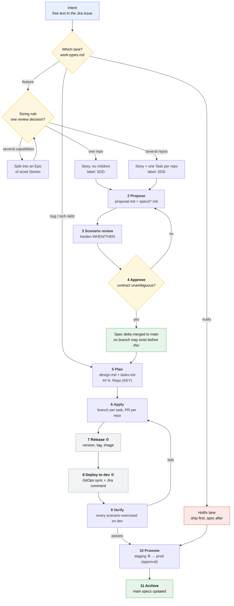

# The pipeline

🇬🇧 English | [🇷🇺 Русский](./pipeline.ru.md)

One page, one diagram, six roles, **eleven gates in three phases** — two of
which no human touches at all, and a third only half. Everything else in
`docs/` is a zoomed-in view of a single lane of this.

```
SHAPE   gates 1–4    intent becomes an approved spec delta        humans
BUILD   gates 5–6    an approved spec delta becomes merged code   humans
SHIP    gates 7–11   merged code becomes verified production      mostly machines
```

## Source of truth

Five different questions, five different answers. Each question has exactly one
place that answers it, and nothing is duplicated between them.

| Question | Single source | Location |
|---|---|---|
| What does the system do **today**? | main specs | `<repo>/openspec/specs/` and `specifications/openspec/specs/` |
| What are we changing **next**, and why? | proposal + spec deltas | `openspec/changes/<change-id>/proposal.md`, `specs/` |
| **How** will we build it? | design + tasks | `openspec/changes/<change-id>/design.md`, `tasks.md` |
| **Who** does it, when, in which sprint? | Jira | Epic / Story / Task |
| What is **actually built**? | code | the application repos |
| What is **actually running**, where? | GitOps + tags | `gitops_*` overlays, `<service>-<semver>` tags |

Jira never holds requirement text. Specs never hold assignees or sprint
numbers. The only reference crossing the boundary is the pair
`.openspec.yaml: jira: PROJ-123` ↔ the Story's `change-id` — see
[Jira ↔ SDD mapping](./jira-sdd-mapping.md).

"Where do I put the source of truth?" therefore has no single answer, and
shouldn't: **behavior truth is per-repo and co-located with the code it
describes**, cross-repo contract truth is the small shared `specifications`
store, work truth is Jira, and deployment truth is git. Centralising all of it
into one store is what makes spec repos rot — they stop being reviewed in the
same commits as the code and drift within weeks.

## The flow



⚙ = fully automated, no human action.

## Gates and owners

Every arrow above has one accountable role. No step is "someone reviews it".

| # | Phase | Gate | Owner | Passes when |
|---|---|---|---|---|
| 1 | Shape | Intake → Proposal | **Team lead** | story is SDD-sized per the rule, labelled `SDD`, routed to the right [lane](./work-types.md) |
| 2 | Shape | Proposal content | **Analytics** | `proposal.md` (why) + `specs/*.md` (what) written; stops before design/tasks |
| 3 | Shape | Scenario review | **Tester** | every requirement has scenarios that are complete, testable, and cover the edges |
| 4 | Shape | Proposal approval | **Tech lead** | contract delta is unambiguous; merged to main **before any code branch exists** |
| 5 | Build | Plan | **Developer** | `design.md` (if warranted) + `tasks.md` with one Jira-keyed section per repo |
| 6 | Build | Apply | **Developer** | tasks worked top-down; contract section lands and publishes before consumers start; PR squash-merged |
| 7 | Ship | Release | ⚙ **automated** | version computed, tag pushed, image built, Jira Fix Version stamped |
| 8 | Ship | Deploy to dev | ⚙ **automated** | GitOps overlay updated, Argo healthy, ticket comments itself |
| 9 | Ship | Verify | **Tester** | every scenario in `specs/*.md` exercised against the **deployed** system |
| 10 | Ship | Promote | ⚙ to staging, **Tech lead** to prod | verified build promoted by digest; approval is about *when*, not *what* |
| 11 | Ship | Archive | **Analytics** (or last developer to ship) | all consuming repos in production; main specs updated to the new canonical truth |

**Gate 4 is the one that makes the metric real:** the spec must be merged
before the first commit on any branch. The
[dual-track sprint model](./scrum.md#the-collision-and-the-fix) is what makes
that free rather than painful — by the time a developer starts, the spec has
been merged for a week.

**Gate 9 is the one that makes the specs pay for themselves.** The scenarios
written at gate 2 are the test script, and they existed before the code did.

Gates 7, 8 and the staging half of 10 are machinery: see
[release](./release.md) and [automation](./automation.md). A developer's last
action on a story is merging a PR; a tester's is moving one card.

## Not every lane uses every gate

The eleven gates are the feature lane. Other work skips the gates that would be
theatre for it — deliberately and by rule, not by improvisation.

| Lane | Gates | Skips |
|---|---|---|
| Feature | 1–11 | — |
| Bug (code disagrees with an existing spec) | 1, 5–11 | 2–4: the spec already says what should happen |
| Bug (spec never covered the case) | 1–11, expedited | — |
| Tech debt / refactor | 1, 5–11 | 2–4: no behavior is being decided |
| Hotfix | 6, 7, 10, then 2–4 retroactively | order inverted; retro-spec due in 2 days |
| Chore / dependency bump | 6–8 | everything else; mostly a bot |
| Spike | none | timeboxed; its output is a decision |

Full rules per lane: [work types](./work-types.md).

## Who reads what

| Role | Your page | You own |
|---|---|---|
| Team lead | [team-lead.md](./roles/team-lead.md) | sizing, labelling, sprint scope, the metric |
| Tech lead | [tech-lead.md](./roles/tech-lead.md) | contract approval, technical approach, production promotion |
| Analytics | [analytics.md](./roles/analytics.md) | `proposal.md` + `specs/*.md` |
| Developer | [developer.md](./roles/developer.md) | `design.md` + `tasks.md` + the code |
| Tester | [tester.md](./roles/tester.md) | scenario quality, verification |
| DevOps | [devops.md](./roles/devops.md) | the pipeline itself, promotion, rollback |

## Why the artifacts are split by role

`openspec propose` generates four artifacts by default. We deliberately stop it
after two.

- `proposal.md` (**why**) and `specs/*.md` (**what** — observable behavior) are
  the business change. Analytics can legitimately write these; the schema's own
  instructions for `specs` say to avoid class names, library choices and
  implementation steps.
- `design.md` (**how**) and `tasks.md` (the step-by-step plan) require knowledge
  of the actual codebase and its conventions. Written by analytics, they'd just
  be rewritten by the implementing developer.

This is enforced, not merely agreed: `openspec/config.yaml` in each repo (and
in `specifications`) declares `rules:` for `design` and `tasks` that tell any
agent to stop after `specs` while drafting an initial proposal. A change with
only `proposal.md` + `specs/` passes `openspec validate` and is mergeable —
`design`/`tasks` show as "blocked"/"ready", not as errors.

## Two working modes

**Mode A — cross-repo authoring.** Analytics, architects and tech leads work in
*this* `workflow` repo, with every application repo checked out as a submodule
side by side, so a proposal spanning several repos can be scoped with full
context.

**Mode B — implementation.** Developers and testers work inside **one single
application repo**, IDE and agent rooted there. You do not need this workflow
repo, and you do not need any other team's repo on disk. Your repo's own
`openspec/` is self-sufficient for local work, and `--store specifications`
reaches shared cross-repo changes without leaving it.

## Checking where you stand

```bash
make check                                    # does this repo pass the SDD metric
openspec list --json                          # local changes and their progress
openspec list --store specifications          # shared cross-repo changes
openspec status --change <change-id> --json   # one change in detail
```

`isComplete: false` means `tasks.md` isn't written yet. That is expected
between gates 4 and 5, and is not an error.

For where a story is in the *ship* half, do not run anything — open the Jira
issue. The `Deployed Environments` field and the deployment comments are
written by [the pipeline](./release.md#the-jira-feedback-loop) and are the
authoritative answer.
