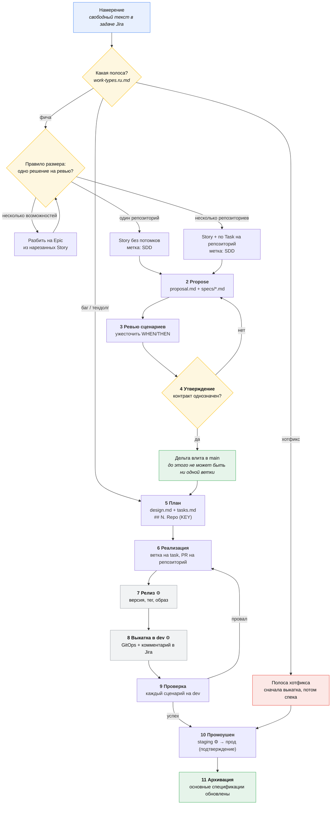

# Пайплайн

[🇬🇧 English](./pipeline.md) | 🇷🇺 Русский

Одна страница, одна диаграмма, шесть ролей, **одиннадцать шлюзов в трёх
фазах** — два из которых человек не трогает вообще, а третий наполовину. Всё
остальное в `docs/` — это увеличенный вид одной полосы отсюда.

```
SHAPE   шлюзы 1–4    намерение превращается в утверждённую дельту спецификации
BUILD   шлюзы 5–6    утверждённая дельта превращается во влитый код
SHIP    шлюзы 7–11   влитый код превращается в проверенный прод (машины)
```

## Источник истины

Шесть разных вопросов — шесть разных ответов. У каждого вопроса ровно одно
место, где на него отвечают, и ничего не дублируется.

| Вопрос | Единственный источник | Где |
|---|---|---|
| Что система делает **сегодня**? | основные спецификации | `<repo>/openspec/specs/` и `specifications/openspec/specs/` |
| Что мы меняем **дальше** и зачем? | proposal + дельты | `openspec/changes/<change-id>/proposal.md`, `specs/` |
| **Как** мы это построим? | design + tasks | `openspec/changes/<change-id>/design.md`, `tasks.md` |
| **Кто** делает, когда, в каком спринте? | Jira | Epic / Story / Task |
| Что **реально построено**? | код | репозитории приложения |
| Что **реально работает** и где? | GitOps + теги | оверлеи `gitops_*`, теги `<service>-<semver>` |

Jira никогда не хранит текст требований. Спецификации никогда не хранят
исполнителей и номера спринтов. Единственная ссылка, пересекающая границу, —
пара `.openspec.yaml: jira: PROJ-123` ↔ `change-id` в Story, см.
[связку Jira ↔ SDD](./jira-sdd-mapping.ru.md).

Поэтому у вопроса «где источник истины» нет одного ответа, и не должно быть:
**истина о поведении лежит по репозиториям, рядом с кодом**, истина о
межрепозиторных контрактах — в маленьком общем хранилище `specifications`,
истина о работе — в Jira, а истина о выкатке — в git. Централизация всего этого
в одно хранилище — ровно то, от чего спек-репозитории гниют: их перестают
ревьюить в тех же коммитах, что и код, и они расходятся с реальностью за
недели.

## Поток



⚙ = полностью автоматизировано, человек не участвует.

## Шлюзы и владельцы

У каждой стрелки выше есть один ответственный. Ни один шаг не звучит как
«кто-нибудь отревьюит».

| № | Фаза | Шлюз | Владелец | Проходится, когда |
|---|---|---|---|---|
| 1 | Shape | Триаж → proposal | **Тимлид** | story нарезана по правилу, помечена `SDD`, отправлена в нужную [полосу](./work-types.ru.md) |
| 2 | Shape | Содержание proposal | **Аналитик** | написаны `proposal.md` (зачем) + `specs/*.md` (что); остановка до design/tasks |
| 3 | Shape | Ревью сценариев | **Тестировщик** | у каждого требования есть полные, проверяемые сценарии, включая края |
| 4 | Shape | Утверждение proposal | **Техлид** | дельта контракта однозначна; влита в main **до появления любой ветки с кодом** |
| 5 | Build | План | **Разработчик** | `design.md` (если оправдан) + `tasks.md` с одной секцией на репозиторий и ключом Jira |
| 6 | Build | Реализация | **Разработчик** | задачи сверху вниз; секция контракта опубликована до старта потребителей; squash-влитие |
| 7 | Ship | Релиз | ⚙ **автоматика** | версия вычислена, тег отправлен, образ собран, Fix Version проставлен |
| 8 | Ship | Выкатка в dev | ⚙ **автоматика** | оверлей обновлён, Argo здоров, тикет комментирует себя сам |
| 9 | Ship | Проверка | **Тестировщик** | каждый сценарий из `specs/*.md` прогнан на **выкаченной** системе |
| 10 | Ship | Промоушен | ⚙ в staging, **техлид** в прод | проверенная сборка промоутится по digest; подтверждение — про *когда*, не про *что* |
| 11 | Ship | Архивация | **Аналитик** (или последний разработчик) | все потребляющие репозитории в проде; основные спецификации обновлены |

**Шлюз 4 — тот, что делает метрику настоящей:** спецификация должна быть влита
до первого коммита в любой ветке.
[Двухтрековая модель спринта](./scrum.ru.md#коллизия-и-её-решение) — то, что
делает это бесплатным, а не мучительным: к моменту старта разработчика
спецификация влита уже неделю.

**Шлюз 9 — тот, ради которого спецификации окупаются.** Сценарии, написанные на
шлюзе 2, — это тест-план, и он существовал раньше кода.

Шлюзы 7, 8 и staging-половина 10 — это механика: см.
[релиз](./release.ru.md) и [автоматизацию](./automation.ru.md). Последнее
действие разработчика по story — влитие PR; тестировщика — перенос одной
карточки.

## Не каждая полоса использует все шлюзы

Одиннадцать шлюзов — это полоса фичи. Другая работа пропускает шлюзы, которые
для неё были бы театром, — намеренно и по правилу, а не по вдохновению.

| Полоса | Шлюзы | Пропускает |
|---|---|---|
| Фича | 1–11 | — |
| Баг (код расходится с существующей спекой) | 1, 5–11 | 2–4: спека уже говорит, как должно быть |
| Баг (спека не покрывала случай) | 1–11, ускоренно | — |
| Техдолг / рефакторинг | 1, 5–11 | 2–4: поведение не решается |
| Хотфикс | 6, 7, 10, затем 2–4 задним числом | порядок инвертирован; ретро-спека за 2 дня |
| Рутина / бамп зависимостей | 6–8 | всё остальное; чаще всего это бот |
| Спайк | нет | таймбокс; результат — решение |

Полные правила по полосам: [типы работ](./work-types.ru.md).

## Кто что читает

| Роль | Ваша страница | Чем владеете |
|---|---|---|
| Тимлид | [team-lead.ru.md](./roles/team-lead.ru.md) | размер, метки, объём спринта, метрика |
| Техлид | [tech-lead.ru.md](./roles/tech-lead.ru.md) | утверждение контрактов, технический подход, промоушен в прод |
| Аналитик | [analytics.ru.md](./roles/analytics.ru.md) | `proposal.md` + `specs/*.md` |
| Разработчик | [developer.ru.md](./roles/developer.ru.md) | `design.md` + `tasks.md` + код |
| Тестировщик | [tester.ru.md](./roles/tester.ru.md) | качество сценариев, проверка |
| DevOps | [devops.ru.md](./roles/devops.ru.md) | сам пайплайн, промоушен, откат |

## Почему артефакты разделены по ролям

`openspec propose` по умолчанию генерирует четыре артефакта. Мы намеренно
останавливаем его после двух.

- `proposal.md` (**зачем**) и `specs/*.md` (**что** — наблюдаемое поведение) —
  это бизнес-изменение. Аналитик законно может это писать; собственная
  инструкция схемы для `specs` требует избегать имён классов, выбора библиотек
  и шагов реализации.
- `design.md` (**как**) и `tasks.md` (пошаговый план) требуют знания реального
  кода и его конвенций. Написанные аналитиком, они будут просто переписаны
  реализующим разработчиком.

Это не договорённость, а принуждение: `openspec/config.yaml` в каждом
репозитории (и в `specifications`) объявляет `rules:` для `design` и `tasks`,
которые велят любому агенту остановиться после `specs` при черновике proposal.
Изменение с одними `proposal.md` + `specs/` проходит `openspec validate` и
вливаемо — `design`/`tasks` показываются как «blocked»/«ready», а не как
ошибки.

## Два режима работы

**Режим A — межрепозиторное авторство.** Аналитики, архитекторы и техлиды
работают в *этом* репозитории `workflow`, где все репозитории приложения
подключены сабмодулями рядом, чтобы proposal на несколько репозиториев можно
было нарезать с полным контекстом.

**Режим B — реализация.** Разработчики и тестировщики работают внутри **одного
репозитория приложения**, IDE и агент укоренены там. Этот репозиторий
`workflow` вам не нужен, и чужие репозитории на диске тоже. Собственный
`openspec/` самодостаточен для локальной работы, а `--store specifications`
достаёт общие межрепозиторные изменения, не выходя из него.

## Где вы сейчас

```bash
make check                                    # проходит ли репозиторий метрику
openspec list --json                          # локальные изменения и прогресс
openspec list --store specifications          # общие межрепозиторные изменения
openspec status --change <change-id> --json   # одно изменение подробно
```

`isComplete: false` означает, что `tasks.md` ещё не написан. Между шлюзами 4 и 5
это ожидаемо и не является ошибкой.

Чтобы узнать, где story в *доставляющей* половине, не запускайте ничего —
откройте задачу в Jira. Поле `Deployed Environments` и комментарии о выкатке
пишет [пайплайн](./release.ru.md#обратная-связь-в-jira), и они являются
авторитетным ответом.
