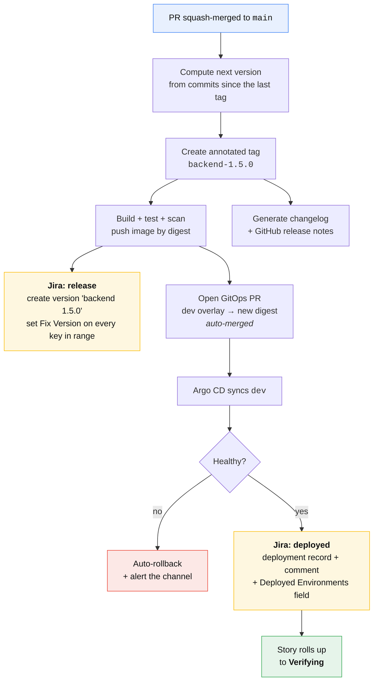
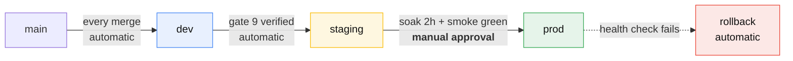

# Release and deployment

🇬🇧 English | [🇷🇺 Русский](./release.ru.md)

Gates 7–11: what happens between "the PR is merged" and "the story is Done".

Everything on this page is automated. A developer merges a PR and does nothing
else; a tester clicks one button; a tech lead approves one production
promotion. Nobody types a version number, edits a changelog, sets a Fix Version
or writes "deployed to dev" in a comment — those are all outputs.

## Principles

1. **Trunk-based.** `main` is always releasable. No `develop`, no `release/*`,
   no long-lived branches. Feature branches live hours to days, not sprints.
2. **Release on merge.** Every merge to `main` produces a version, a tag, an
   immutable image, and an automatic deployment to `dev`. There is no separate
   "cut a release" activity.
3. **Build once, promote the artifact.** The image that runs in production is
   byte-identical to the one that ran in dev. Environments differ by config,
   never by build.
4. **Per-service versioning.** Each service has its own version line. There is
   no global product version.
5. **Git is the deployment truth.** The desired state of every environment is a
   commit in a `gitops_*` repo. Nothing is deployed by a human running a
   command.
6. **Every artifact traces to a Jira key**, and every Jira key traces back to
   the artifacts that carry it. That traceability is generated, never
   maintained.

## Why per-service versions, not one product version

A single product version forces every service to release together: the slowest
service sets the pace, an unrelated frontend fix waits for a backend migration,
and rollback means rolling back everything. Per-service versioning is what lets
frontend and backend
[implement the same story in parallel](../AGENTS.md#two-working-modes) and
release independently.

The cost is that "what is in production?" has several answers instead of one.
That cost is paid by the Jira Fix Version mapping below, which is generated —
so it is paid by a script, not by a person.

## Versioning

**Semantic versioning per service, derived from commit messages.** Nobody edits
a version number by hand; a hand-edited version is a merge conflict waiting to
happen.

| Commit since the last tag | Bump | Example |
|---|---|---|
| `feat:` | **minor** | 1.4.2 → 1.5.0 |
| `fix:`, `perf:` | **patch** | 1.4.2 → 1.4.3 |
| `feat!:` or `BREAKING CHANGE:` in the body | **major** | 1.4.2 → 2.0.0 |
| `chore:`, `docs:`, `test:`, `ci:`, `refactor:` | **patch** | 1.4.2 → 1.4.3 |
| nothing since the last tag | no release | — |

For `common` and any other published package, **major means a contract break**,
and a contract break is a spec delta in `specifications` by definition. A major
bump with no shared spec delta is a bug in the process; CI warns on it.

### Commit and PR conventions

**PRs are squash-merged.** One PR, one commit on `main`, one changelog entry,
one set of Jira keys. This is what makes the tag-range scan reliable — with
merge commits, a range contains half-finished work-in-progress messages and the
generated notes become unusable.

The squash commit's subject is the PR title, which CI validates:

```
<type>(<scope>)!: <summary>

<body>

PROJ-125
```

Concretely:

```
feat(auth): add POST /auth/sso callback endpoint

Accepts the IdP assertion, exchanges it for a session, and sets the
session cookie. Implements the "SSO callback" requirement.

PROJ-125
```

The Jira key is appended to the PR body automatically from the branch name by
[`.github/workflows/pr-conventions.yml`](../.github/workflows/pr-conventions.yml)
if the author forgets, so it is a convention with a safety net rather than a
rule people fail.

### Tags and images

```
git tag:   backend-1.5.0                      # <service>-<semver>, annotated
image:     registry/backend:1.5.0             # the promoted, human-readable tag
           registry/backend:1.5.0-a3f9c21     # immutable, includes the commit
           registry/backend@sha256:…          # what GitOps actually pins
```

GitOps overlays pin the **digest**, not the tag. A tag can be moved; a digest
cannot, and "which build is actually running in prod" must have exactly one
answer.

## The release pipeline

What happens automatically the moment a PR is squash-merged to `main`:



Wall-clock target, merge to running in dev: **under 15 minutes.** If it is
longer than that, developers stop trusting dev and start testing on their
laptops, and the whole feedback loop this pipeline exists to create disappears.

Implementation: [`.github/workflows/release.yml`](../.github/workflows/release.yml),
[`scripts/release-version.sh`](../scripts/release-version.sh),
[`scripts/jira-release.sh`](../scripts/jira-release.sh).

## Environments and promotion

| Env | Deployed by | Contains | Approval | Data |
|---|---|---|---|---|
| `dev` | automatic, every merge | latest `main` of every service | none | synthetic |
| `staging` | automatic, after gate 9 passes | verified versions only | none | anonymised prod copy |
| `prod` | GitOps PR merge | promoted from staging | **tech lead / release manager** | real |



**Promotion is a digest copy between overlays**, nothing else:

```
gitops_backend/
  apps/backend/
    base/
    overlays/
      dev/      kustomization.yaml   image digest ← written by automation
      staging/  kustomization.yaml   image digest ← written by automation
      prod/     kustomization.yaml   image digest ← written by a PR a human approves
```

A promotion PR to `prod` changes exactly one line. If a promotion PR touches
anything other than a digest, that is a config change and it goes through its
own review — never bundled into a promotion, where nobody reads it.

**Production promotion is batched, not continuous.** Dev and staging move
constantly; prod moves on a cadence the team chooses — daily at a fixed hour is
the usual answer. The approval is a human deciding *when*, never *what*: the
what has already been verified.

## The Jira feedback loop

This is the part that makes the whole system legible to people who never open
GitHub. It has three layers, and they are written by two scripts.

### Layer 1 — Fix Version, set at tag time

When `backend-1.5.0` is tagged, `scripts/jira-release.sh`:

1. Ensures the Jira version **`backend 1.5.0`** exists in the project (creates
   it, unreleased, if missing).
2. Scans commits in `backend-1.4.3..backend-1.5.0` for issue keys.
3. Bulk-sets Fix Version `backend 1.5.0` on each issue found — **adding**, never
   replacing, because an issue legitimately carries one Fix Version per service
   it touched.
4. Sets the version's release date and marks it **Released** only when that
   version reaches production.

A story spanning two services ends up with two Fix Versions:

```
Story PROJ-123  "Single sign-on"
  Fix Versions:  common 2.4.0, backend 1.5.0, frontend 2.1.0
```

which reads exactly right: *this story shipped as these builds*.

### Layer 2 — deployment records and the ticket comment

When Argo CD reports a service healthy in an environment,
`scripts/jira-deploy.sh` runs for every issue key in that release:

- **A deployment record** via Jira's deployments API, so the issue's
  development panel shows the environment, the version, the state and a link to
  the pipeline run. Structured, queryable, no comment spam.
- **A comment, once per environment per issue.** Re-deploying the same service
  to the same environment updates the record and does *not* add a second
  comment.

  > 🚀 **Deployed to dev** — `backend 1.5.0`
  > Tag `backend-1.5.0` · digest `sha256:a3f9…` · link to the pipeline run
  > 2026-08-22 14:06 UTC

- **The `Deployed Environments` custom field**, set to a comma-separated list
  (`dev,staging`). This is the field board automation and JQL read; the comment
  is for humans and the deployment record is for the panel.

### Layer 3 — status rollup

| Signal | Jira effect |
|---|---|
| task's service deployed to `dev` | Task → `Deployed to dev` |
| **all** of a story's tasks on `dev` | Story → `Verifying`, tester notified |
| tester passes gate 9 | Story → `Ready to release`, staging promotion triggered |
| all of a story's services in `prod` | Story → `Done`, Fix Versions marked Released |
| version marked Released | Epic progress recalculated |

The rollups are Jira automation rules, listed with their triggers in
[the automation catalog](./automation.md#jira-automation-rules).

### Answering "when will my fix ship?"

Anyone — support, product, the person who reported it — opens the issue and
reads the development panel. `Deployed Environments: dev,staging` means it is
verified and waiting for the next production promotion. No Slack thread, no
asking a developer, no release spreadsheet.

## Release notes

Generated twice, for two audiences, from the same data:

- **Technical**, per service, per tag: the conventional-commit changelog, in the
  GitHub release. Grouped by type, with Jira keys linked.
- **Product**, per production promotion: the set of Jira issues whose Fix
  Versions became Released, grouped by Epic, using issue summaries rather than
  commit subjects. Posted to the release channel and attached to the Jira
  version.

Nobody writes either one. If a release note reads badly, fix the issue summary
or the commit subject — the generator is not the problem, its input is.

## Hotfix releases

The [hotfix lane](./work-types.md#hotfix) uses the same machinery with three
differences:

1. **Branch from the production tag**, not `main`:
   `git switch -c PROJ-999-hotfix-token-leak backend-1.4.2`.
2. **Patch bump, straight to prod.** The promotion PR is opened against the
   `prod` overlay directly and approved live. Staging is skipped; the test
   suite is not.
3. **Forward-port to `main` the same day.** CI fails any release whose tag
   ancestry does not contain every published hotfix tag, so a forgotten
   forward-port cannot silently revert the fix — the next ordinary release
   turns red instead.

Everything else — version, tag, image, Fix Version, deployment record, comment —
happens identically, so a hotfix is as traceable as a planned release.

## Rollback

**Rollback is a promotion to an older digest.** It is the same operation as a
deploy, in the other direction, which is what makes it safe enough to use
reflexively at 3am.

| Situation | Action | Who |
|---|---|---|
| health check fails right after deploy | automatic revert of the GitOps commit | pipeline |
| bad behavior found within minutes | `scripts/rollback.sh <service> <env>` — reverts the overlay | anyone on call |
| bad behavior found later, data written | roll **forward** with a hotfix | tech lead |

Once a release has written data in a shape the previous version cannot read,
rolling back stops being safe. That is why the pipeline rolls back
automatically only within the health-check window, and why every migration is
required to be backward-compatible for one release — expand, migrate,
contract, never rename in place.

A rollback re-runs the Jira feedback loop, so the issues' `Deployed
Environments` field loses `prod` and the comment says *rolled back*. Jira never
claims something is live when it is not.

## Release metrics

The four DORA metrics fall out of this pipeline for free — every input is
already a timestamped event, so none of them is self-reported.

| Metric | Computed from | Target |
|---|---|---|
| Deployment frequency | tags pushed per service per week | daily or better |
| Lead time for change | gate 4 merge → prod deployment record | < 5 days |
| Change failure rate | rollbacks + hotfixes ÷ prod promotions | < 15% |
| Time to restore | incident opened → prod deployment record | < 1 hour |

Alongside them, the two this workflow adds:

- **SDD adherence** — stories passing `make check` ÷ stories closed.
- **Spec-to-prod lead time** — gate 4 → gate 10. If this grows while lead time
  for change is flat, the Ready pool is stale and discovery is running too far
  ahead of delivery.

## What we deliberately do not do

- **No release branches.** They exist to stabilise a build over weeks; if a
  build needs weeks to stabilise, the problem is test coverage, and a branch
  will not fix it.
- **No manual version bumps.** Version files in the repo are a merge-conflict
  generator and drift from the tags within a month.
- **No environment-specific builds.** One artifact, config injected at runtime.
  A `-prod` build cannot be tested by testing the `-staging` build.
- **No deploying from a laptop.** Not even at 3am, not even by the person who
  wrote the pipeline. Git is the deployment truth or it is not.
- **No manual Fix Version editing.** If it is wrong, the commit range or the
  issue key is wrong; fix the input.
- **No release freeze as a routine.** A freeze is an admission that the
  pipeline is not trusted. Fix the trust, keep the freeze for genuine external
  events.

## See also

| | |
|---|---|
| [Pipeline](./pipeline.md) | the eleven gates |
| [Automation](./automation.md) | every trigger, action and secret |
| [Work types](./work-types.md) | which lane a piece of work takes to get here |
| [DevOps role](./roles/devops.md) | who owns this pipeline |
| [Build guide](./build-guide.md) | how to construct all of it, step by step |
