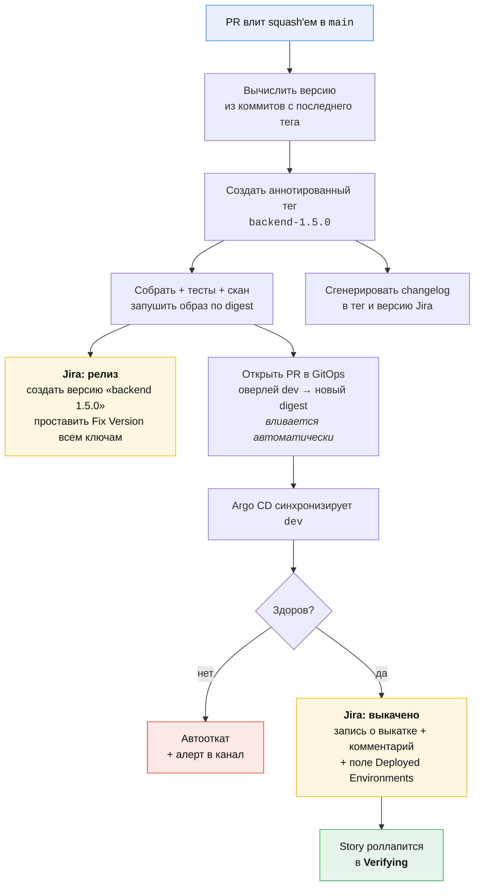
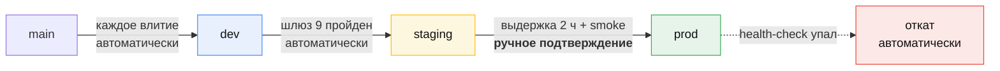

# Релиз и выкатка

[🇬🇧 English](./release.md) | 🇷🇺 Русский

Шлюзы 7–11: что происходит между «PR влит» и «story готова».

Всё на этой странице автоматизировано. Разработчик вливает PR и больше не
делает ничего; тестировщик нажимает одну кнопку; техлид подтверждает один
промоушен в прод. Никто не набирает номер версии, не правит changelog, не
проставляет Fix Version и не пишет «выкачено в dev» в комментарии — это всё
результаты работы, а не работа.

## Принципы

1. **Trunk-based.** `main` всегда релизопригоден. Ни `develop`, ни `release/*`,
   ни долгоживущих веток. Ветки фич живут часы и дни, а не спринты.
2. **Релиз на влитии.** Каждое влитие в `main` порождает версию, тег,
   неизменяемый образ и автоматическую выкатку в `dev`. Отдельной деятельности
   «нарезать релиз» не существует.
3. **Собрать один раз, промоутить артефакт.** Образ в проде побайтово тот же,
   что крутился в dev. Окружения различаются конфигурацией, никогда сборкой.
4. **Версии по сервисам.** У каждого сервиса своя линия версий. Глобальной
   версии продукта нет.
5. **Git — истина о выкатке.** Желаемое состояние каждого окружения — это
   коммит в репозитории `gitops_*`. Ничего не выкатывается человеком, набравшим
   команду.
6. **Каждый артефакт связан с ключом Jira**, и каждый ключ Jira ведёт назад к
   артефактам, которые его несут. Эта прослеживаемость генерируется, а не
   поддерживается.

## Почему версии по сервисам, а не одна на продукт

Единая версия продукта заставляет все сервисы релизиться вместе: темп задаёт
самый медленный сервис, несвязанная правка фронтенда ждёт миграции бэкенда, а
откат означает откат всего. Версии по сервисам — то, что позволяет фронтенду и
бэкенду [реализовывать одну story параллельно](../AGENTS.md#two-working-modes)
и релизиться независимо.

Цена в том, что у вопроса «что в проде» становится несколько ответов вместо
одного. Эту цену платит связка с Fix Version ниже, а она генерируется — то есть
платит скрипт, а не человек.

## Версионирование

**Semver на сервис, выведенный из сообщений коммитов.** Номер версии не правит
никто руками; правленная руками версия — это конфликт слияния, ждущий своего
часа.

| Коммит с последнего тега | Инкремент | Пример |
|---|---|---|
| `feat:` | **minor** | 1.4.2 → 1.5.0 |
| `fix:`, `perf:` | **patch** | 1.4.2 → 1.4.3 |
| `feat!:` или `BREAKING CHANGE:` в теле | **major** | 1.4.2 → 2.0.0 |
| `chore:`, `docs:`, `test:`, `ci:`, `refactor:` | **patch** | 1.4.2 → 1.4.3 |
| ничего с последнего тега | релиза нет | — |

Для `common` и любого публикуемого пакета **major означает слом контракта**, а
слом контракта по определению — это дельта спецификации в `specifications`.
Major без общей дельты — ошибка процесса; CI об этом предупреждает.

### Конвенции коммитов и PR

**PR вливаются через squash.** Один PR — один коммит в `main`, одна запись в
changelog, один набор ключей Jira. Именно это делает надёжным сканирование
диапазона тегов: с merge-коммитами в диапазон попадают промежуточные сообщения
и сгенерированные notes становятся нечитаемыми.

Заголовок squash-коммита — это заголовок PR, который проверяет CI:

```
<type>(<scope>)!: <summary>

<body>

PROJ-125
```

Конкретно:

```
feat(auth): add POST /auth/sso callback endpoint

Accepts the IdP assertion, exchanges it for a session, and sets the
session cookie. Implements the "SSO callback" requirement.

PROJ-125
```

В Bitbucket squash-коммит собирается из **заголовка и описания** pull request,
поэтому ключ Jira должен быть в одном из них. Если автор забыл,
[`sddPrChecks`](../vars/sddPrChecks.groovy) допишет его в описание из имени
ветки — конвенция со страховкой, а не правило, которое люди проваливают.

### Теги и образы

```
git tag:   backend-1.5.0                      # <service>-<semver>, аннотированный
образ:     registry/backend:1.5.0             # промоутируемый, человекочитаемый тег
           registry/backend:1.5.0-a3f9c21     # неизменяемый, с коммитом
           registry/backend@sha256:…          # то, что реально пинит GitOps
```

Оверлеи GitOps пинят **digest**, а не тег. Тег можно передвинуть, digest —
нет, а у вопроса «какая сборка реально крутится в проде» должен быть ровно один
ответ.

## Релизный пайплайн

Что происходит автоматически в момент squash-влития PR в `main`:



Целевое время от влития до работы в dev: **меньше 15 минут.** Если дольше,
разработчики перестают доверять dev и начинают тестировать на ноутбуках, и вся
петля обратной связи, ради которой пайплайн существует, исчезает.

Реализация: [`vars/sddRelease.groovy`](../vars/sddRelease.groovy),
[`scripts/release-version.sh`](../scripts/release-version.sh),
[`scripts/jira-release.sh`](../scripts/jira-release.sh). Пайплайн — общая
библиотека Jenkins; в каждом репозитории лежит `Jenkinsfile` на пять строк,
см. [`examples/Jenkinsfile.app`](../examples/Jenkinsfile.app).

## Окружения и промоушен

| Окружение | Кем выкатывается | Что содержит | Подтверждение | Данные |
|---|---|---|---|---|
| `dev` | автоматически, каждое влитие | последний `main` каждого сервиса | нет | синтетические |
| `staging` | автоматически, после шлюза 9 | только проверенные версии | нет | обезличенная копия прода |
| `prod` | влитием PR в GitOps | промоутится из staging | **техлид / релиз-менеджер** | настоящие |



**Промоушен — это копирование digest между оверлеями**, и ничего больше:

```
gitops_backend/
  apps/backend/
    base/
    overlays/
      dev/      kustomization.yaml   digest образа ← пишет автоматика
      staging/  kustomization.yaml   digest образа ← пишет автоматика
      prod/     kustomization.yaml   digest образа ← пишет PR, который утверждает человек
```

PR промоушена в `prod` меняет ровно одну строку. Если PR промоушена трогает
что-то, кроме digest, — это изменение конфигурации, и ему нужно собственное
ревью, а не проезд там, где его никто не читает.

**Промоушен в прод пакетный, а не непрерывный.** Dev и staging двигаются
постоянно; прод двигается с той частотой, которую выбрала команда, — обычно
ежедневно в фиксированный час. Подтверждение — это человек, решающий *когда*, и
никогда *что*: «что» уже проверено.

## Обратная связь в Jira

Это та часть, которая делает всю систему понятной людям, никогда не
открывающим Bitbucket или Jenkins. В ней три слоя, и пишут их два скрипта.

### Слой 1 — Fix Version, проставляется на теге

Когда создан тег `backend-1.5.0`, `scripts/jira-release.sh`:

1. Убеждается, что версия Jira **`backend 1.5.0`** существует в проекте
   (создаёт её нерелизнутой, если нет).
2. Сканирует коммиты в `backend-1.4.3..backend-1.5.0` на ключи задач.
3. Массово проставляет Fix Version `backend 1.5.0` каждой найденной задаче —
   **добавляя**, а не заменяя, потому что задача законно несёт по одной Fix
   Version на каждый затронутый сервис.
4. Ставит дату релиза и помечает версию **Released** только когда она доезжает
   до прода.

Story, охватывающая два сервиса, получает две Fix Version:

```
Story PROJ-123  «Single sign-on»
  Fix Versions:  common 2.4.0, backend 1.5.0, frontend 2.1.0
```

что читается ровно правильно: *эта story уехала вот такими сборками*.

### Слой 2 — записи о выкатке и комментарий в тикете

Когда Argo CD сообщает, что сервис здоров в окружении,
`scripts/jira-deploy.sh` отрабатывает по каждому ключу из релиза:

- **Запись о выкатке** через deployments API Jira, чтобы в панели разработки
  задачи были видны окружение, версия, состояние и ссылка на прогон пайплайна.
  Структурировано, ищется, без спама комментариями.
- **Комментарий, один на окружение на задачу.** Повторная выкатка того же
  сервиса в то же окружение обновляет запись и *не* добавляет второй
  комментарий.

  > 🚀 **Выкачено в dev** — `backend 1.5.0`
  > Тег `backend-1.5.0` · digest `sha256:a3f9…` · ссылка на прогон пайплайна
  > 2026-08-22 14:06 UTC

- **Кастомное поле `Deployed Environments`**, куда пишется список через запятую
  (`dev,staging`). Именно его читают автоматизация доски и JQL; комментарий —
  для людей, а запись о выкатке — для панели.

### Слой 3 — роллап статусов

| Сигнал | Эффект в Jira |
|---|---|
| сервис task'а выкачен в `dev` | Task → `Deployed to dev` |
| **все** task'и story в `dev` | Story → `Verifying`, тестировщик уведомлён |
| тестировщик прошёл шлюз 9 | Story → `Ready to release`, запускается промоушен в staging |
| все сервисы story в `prod` | Story → `Done`, Fix Version помечены Released |
| версия помечена Released | пересчитывается прогресс Epic'а |

Роллапы — это правила автоматизации Jira, перечисленные с триггерами в
[каталоге автоматизации](./automation.ru.md#правила-автоматизации-jira).

### Ответ на «когда уедет моя правка?»

Любой — поддержка, продукт, тот, кто завёл задачу — открывает её и читает
панель разработки. `Deployed Environments: dev,staging` означает, что она
проверена и ждёт ближайшего промоушена в прод. Ни треда в Slack, ни вопроса
разработчику, ни релизной таблички.

## Release notes

Генерируются дважды, для двух аудиторий, из одних и тех же данных:

- **Технические**, на сервис, на тег: changelog из conventional commits. В
  Bitbucket Data Center нет Releases, поэтому они живут в двух местах, которые
  есть: в **сообщении аннотированного тега** и в **описании версии Jira**.
  Jenkins дополнительно сохраняет их артефактом сборки.
- **Продуктовые**, на каждый промоушен в прод: набор задач, чьи Fix Version
  стали Released, сгруппированные по Epic'ам, по заголовкам задач, а не по
  сообщениям коммитов. Публикуются в релизный канал и прикладываются к версии
  Jira.

Ни то, ни другое никто не пишет. Если release note читается плохо, чините
заголовок задачи или заголовок коммита — проблема не в генераторе, а в его
входе.

## Хотфикс-релизы

[Полоса хотфикса](./work-types.ru.md#хотфикс) использует ту же машинерию с
тремя отличиями:

1. **Ветка от прод-тега**, не от `main`:
   `git switch -c PROJ-999-hotfix-token-leak backend-1.4.2`.
2. **Patch-инкремент, сразу в прод.** PR промоушена открывается прямо против
   оверлея `prod` и утверждается вживую. Staging пропускается; набор тестов —
   нет.
3. **Форвард-порт в `main` в тот же день.** CI роняет любой релиз, в предках
   тега которого нет каждого опубликованного хотфикс-тега, — так что забытый
   форвард-порт не может молча откатить починку: вместо этого краснеет
   следующий обычный релиз.

Всё остальное — версия, тег, образ, Fix Version, запись о выкатке,
комментарий — происходит идентично, так что хотфикс так же прослеживаем, как
плановый релиз.

## Откат

**Откат — это промоушен на более старый digest.** Та же операция, что и
выкатка, в другую сторону, и именно поэтому она достаточно безопасна, чтобы
пользоваться ею рефлекторно в три ночи.

| Ситуация | Действие | Кто |
|---|---|---|
| health-check упал сразу после выкатки | автоматический revert коммита GitOps | пайплайн |
| плохое поведение замечено через минуты | `scripts/promote.sh --to prod --digest <previous>` | любой дежурный |
| замечено позже, данные уже записаны | катимся **вперёд** хотфиксом | техлид |

Как только релиз записал данные в форме, которую предыдущая версия прочитать не
может, откат перестаёт быть безопасным. Поэтому пайплайн откатывает
автоматически только внутри окна health-check, и поэтому каждая миграция обязана
быть обратно совместимой один релиз — expand, migrate, contract, и никогда
переименование на месте.

Откат заново прогоняет обратную связь в Jira, так что поле
`Deployed Environments` теряет `prod`, а комментарий говорит *откачено*. Jira
никогда не утверждает, что что-то работает, когда это не так.

## Метрики релиза

Четыре метрики DORA выпадают из этого пайплайна бесплатно — каждый вход и так
является событием с меткой времени, так что ни одна из них не сообщается вручную.

| Метрика | Из чего считается | Цель |
|---|---|---|
| Частота выкаток | тегов на сервис в неделю | ежедневно и чаще |
| Lead time изменения | влитие на шлюзе 4 → запись о выкатке в прод | < 5 дней |
| Доля неудачных изменений | откаты + хотфиксы ÷ промоушены в прод | < 15% |
| Время восстановления | открытие аварии → запись о выкатке в прод | < 1 часа |

Плюс две, которые добавляет этот процесс:

- **Соблюдение SDD** — story, прошедшие `make check`, ÷ закрытые story.
- **Lead time от спеки до прода** — шлюз 4 → шлюз 10. Если он растёт, пока
  lead time изменения стоит на месте, пул Ready протухает и discovery убежал от
  delivery слишком далеко.

## Чего мы намеренно не делаем

- **Никаких релизных веток.** Они существуют, чтобы стабилизировать сборку
  неделями; если сборке нужны недели на стабилизацию, проблема в покрытии
  тестами, и ветка её не решит.
- **Никаких ручных инкрементов версии.** Файлы с версией в репозитории —
  генератор конфликтов слияния, и они расходятся с тегами за месяц.
- **Никаких сборок под окружение.** Один артефакт, конфигурация подставляется в
  рантайме. Сборку `-prod` нельзя протестировать, тестируя сборку `-staging`.
- **Никакой выкатки с ноутбука.** Даже в три ночи, даже тем, кто написал
  пайплайн. Либо git — истина о выкатке, либо нет.
- **Никакой ручной правки Fix Version.** Если она неверна, неверен диапазон
  коммитов или ключ задачи; чините вход.
- **Никакой заморозки релизов как рутины.** Заморозка — признание, что
  пайплайну не доверяют. Чините доверие, а заморозку оставьте для настоящих
  внешних событий.

## Смотрите также

| | |
|---|---|
| [Пайплайн](./pipeline.ru.md) | одиннадцать шлюзов |
| [Автоматизация](./automation.ru.md) | каждый триггер, действие и секрет |
| [Типы работ](./work-types.ru.md) | какой полосой работа сюда доезжает |
| [Роль DevOps](./roles/devops.ru.md) | кто владеет этим пайплайном |
| [Руководство по сборке](./build-guide.ru.md) | как построить всё это по шагам |
