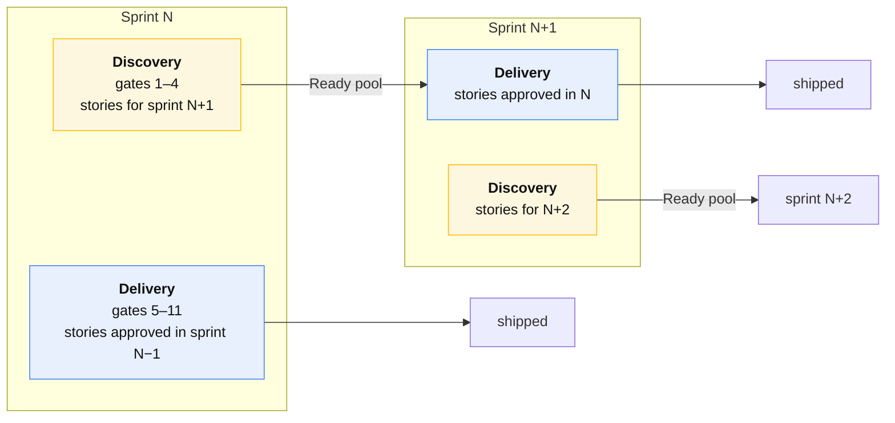

# The Scrum layer

🇬🇧 English | [🇷🇺 Русский](./scrum.ru.md)

[The pipeline](./pipeline.md) says what has to be true before work moves
forward. This page says **when it happens, who is in the room, and what the
board looks like** — the calendar and the ceremony around the gates.

It exists to solve one specific collision.

## The collision, and the fix

Gate 4 says: **no branch may exist before the spec delta is merged.** Plain
one-track Scrum says: pull a story into the sprint and finish it in the sprint.
Those two cannot both hold. If a story is specced and built in the same sprint,
either the spec is rushed to unblock coding on Wednesday, or coding starts
before the spec and the metric fails — and both happen every single time.

So the fix is not discipline. It is **dual-track**: two tracks running in
parallel every sprint, on the same team, with the same people at different
moments.

**Discovery** (gates 1–4) turns intent into an approved spec delta. Owned by
team lead, analytics, tester, tech lead. Its output is the **Ready pool**.

**Delivery** (gates 5–11) turns an approved spec delta into production. Owned
by developers and the tester. Its input is *only* the Ready pool.

Nothing enters delivery that did not come out of discovery a sprint earlier.
That one rule makes gate 4 free — by the time a developer touches a story, the
spec has been merged for a week, and "spec before code" is not a discipline
anyone has to remember.

**The cost is one sprint of lead time on the first story, and zero after
that**, because both tracks run every sprint. Teams that reject dual-track
usually think they are buying a sprint of latency; they are buying it once.

### The one exception

An S1/S2 bug and a hotfix enter delivery directly — they have no discovery
phase because [they have no spec delta](./work-types.md#bug). That is the
[interrupt budget](#the-interrupt-budget), and it is capped.

## The two boards

One Jira project, one backlog, **two boards** over the same issues. Nobody
needs to look at both.

### Discovery board — the team lead's board

| Column | Gate | Card moves when | Moved by |
|---|---|---|---|
| `Intake` | 1 | issue created and sized | team lead |
| `Specifying` | 2 | analytics picks it up | analytics |
| `Scenario review` | 3 | proposal PR opened | **automation** (PR opened → transition) |
| `Spec approval` | 4 | tester approves the PR | **automation** |
| `Ready` | — | proposal PR merged to `main` | **automation** (merge → transition) |

`Ready` is the pool. It is the only queue in the system that is allowed to be
long, and it should hold roughly **1.5 sprints of work** — enough that delivery
never starves, short enough that specs do not go stale before anyone builds
them.

### Delivery board — the developers' board

| Column | Gate | Card moves when | Moved by |
|---|---|---|---|
| `Ready` | — | (inherited from discovery) | — |
| `In progress` | 5–6 | first branch pushed with the key | **automation** (Jira DevOps) |
| `In review` | 6 | PR opened | **automation** |
| `Deployed to dev` | 7–8 | Argo reports the release synced to dev | **automation** |
| `Verifying` | 9 | all of the story's tasks are on dev | **automation** (rollup) |
| `Ready to release` | 10 | tester passes every scenario | tester |
| `Done` | 10–11 | prod deploy confirmed | **automation** |

**Six of the eight transitions are automated.** A developer moves no cards at
all: pushing a branch, opening a PR and merging it moves the card. The tester
moves exactly one card. This is deliberate — every manual transition is a
status that will be wrong by Thursday.

Wiring for each of these is in [the automation catalog](./automation.md).

### Story status is a rollup, never typed

A Story with child Tasks has **no status of its own**. Jira automation derives
it:

| When | Story becomes |
|---|---|
| any child moves to `In progress` | `In progress` |
| all children reach `Deployed to dev` | `Verifying` |
| tester passes | `Ready to release` |
| all children's services are in prod | `Done` |

Nobody drags a Story. If a Story's status disagrees with its Tasks, the rule is
broken, not the Tasks.

## Definition of Ready

A story may enter the delivery board only when **all** of these are true. This
is the DoR, and it is mechanically checkable — `/sdd:gate` checks it.

1. Issue type is Story, labelled `SDD`, with a `change-id` recorded.
2. `proposal.md` + `specs/*.md` are **merged to `main`** (gate 4 passed).
3. The tester has passed gate 3 — every requirement has scenarios, including
   the unhappy paths.
4. The affected repos are known, and one Task exists per repo.
5. It is estimated.
6. It has no unresolved dependency on another story still in discovery.

A story failing any of these does not get pulled "provisionally". Provisional
pulls are how the Ready pool stops meaning anything.

## Definition of Done

A story is Done when **all** of these are true — not when the code is merged.

1. Every `tasks.md` checkbox is `[x]`.
2. Every PR merged, CI green, no `TODO(PROJ-nnn)` left pointing at this story.
3. Every scenario in `specs/*.md` verified against the deployed system
   (gate 9).
4. The change is **running in production** in every affected service.
5. Jira Fix Version is set on the story and its tasks, and that version is
   marked Released.
6. The OpenSpec change is archived and the main specs updated (gate 11).
7. Feature flags, if any, have a removal Task with a due date.

Point 4 is the one teams shave. "Done" meaning "merged" is what produces a
sprint review demoing something no user can reach.

## Estimation

- **Story points on Stories only.** Tasks are repo slices and carry no points —
  pointing both double-counts and makes velocity meaningless.
- **Estimate at refinement, by the developers who will build it**, after the
  spec delta exists. Estimating an unspecced story is estimating a guess.
- **The scale is relative and small**: 1, 2, 3, 5, 8. **There is no 13.** A
  story that feels like a 13 has failed the sizing rule and is an Epic — the
  estimate is the smoke detector for bad sizing.
- **Discovery work is estimated separately** in the discovery board's own
  points, because it is different people. Do not mix the two velocities.
- **Bugs are pointed**; they consume the same capacity as anything else.
  Not pointing bugs makes a bug-heavy sprint look like a slow sprint.

Velocity is a **planning input**, not a target and never a performance measure.
The moment velocity is reported upward as a score, estimates inflate and the
number stops being usable for planning — which is the only thing it was for.

## Capacity and the 20% rule

Split every sprint's delivery capacity up front, before any story is pulled:

| Slice | Share | Owner | Spent on |
|---|---|---|---|
| Feature delivery | **60%** | team lead | stories from the Ready pool |
| Tech debt | **20%** | tech lead | [tech-debt lane](./work-types.md#tech-debt) |
| Interrupts | **20%** | held empty | S1/S2 bugs, hotfixes, escalations |

**The tech-debt 20% is the tech lead's to spend without justifying story by
story.** Debt work that has to win a priority argument against a feature loses
every time, in every team, forever. Take the argument off the table by
budgeting it.

**The interrupt 20% is planned as empty.** A sprint planned to 100% is a sprint
that fails the first time production hiccups, and then the failure gets blamed
on estimates. If a sprint ends with the interrupt budget unspent, pull one more
story from Ready on the last Wednesday — never plan it in on day one.

### The interrupt budget

Unplanned work enters mid-sprint under two rules:

1. **Only S1/S2** ([severity table](./work-types.md#severity-drives-the-lane-not-the-ceremony)).
   S3/S4 wait for the next planning like everything else.
2. **When the budget is spent, something comes out.** The team lead names the
   story being dropped, in the sprint, visibly. Silent overcommitment is what
   makes teams stop trusting sprint scope.

Track interrupt spend as a first-class number in the retro. Three sprints
running over budget is not a capacity problem, it is a quality problem, and
the fix belongs in the tech-debt slice.

## Ceremonies

Two-week sprint. Total ceremony cost: **~4.5 hours per person per sprint**,
about 5% of capacity. Anything above that needs to justify itself.

| Ceremony | When | Length | Who | Output |
|---|---|---|---|---|
| [Refinement](#refinement) | Wed of week 1 | 60 min | whole team | sized, estimated stories |
| [Spec review](#spec-review) | Thu, weekly | 30 min | analytics, tester, tech lead | gate 3 + 4 passes |
| [Planning](#planning) | Mon of week 1 | 60 min | whole team | sprint scope |
| [Standup](#standup) | daily | 10 min | delivery team | blockers named |
| [Review](#review) | Fri of week 2 | 45 min | team + stakeholders | shipped work demoed |
| [Retro](#retro) | Fri of week 2 | 45 min | team | one change, one owner |

### Refinement

**The most valuable hour of the sprint**, and the one most often cancelled.
This is where the sizing rule gets applied and where bad stories die cheaply.

Agenda, per story, ~10 minutes:

1. Team lead reads the intent aloud. If it takes more than two sentences, it is
   an Epic.
2. **Apply the sizing rule** — one review decision? one repo or several?
3. Name the affected repos. That is the task list; there are no other tasks.
4. Developers estimate. **A 13 means go back to step 2.**
5. Tester names the riskiest scenario. If nobody can name one, the story is not
   understood yet.

Refine **next** sprint's stories, not this one's. Refining what you are about
to build is planning; refining what you will build later is refinement.

### Spec review

Thirty minutes weekly to clear gates 3 and 4. Not a meeting to *do* the review —
the review happens asynchronously on the proposal PR. This is the slot to
**unblock the ones that stalled**: disagreements about a contract, an ambiguous
scenario, a proposal waiting three days for an approver.

Standing rule: **a proposal PR older than two working days is discussed here,
out loud.** Discovery blocking silently is the failure mode that empties the
Ready pool two sprints later, when nobody remembers why.

### Planning

Short, because refinement did the work. If planning runs long, refinement was
skipped.

1. Confirm capacity and the three slices (60/20/20).
2. Pull from the Ready pool **in priority order** until the feature slice is
   full. No debate about *what* the stories mean — that was refinement.
3. Tech lead names the debt work for their 20%.
4. **Sequence the contract tasks first.** Any story touching `common` or a
   shared contract has its contract task scheduled in the first days, because
   [everything else in that story is gated behind it publishing](./jira-sdd-mapping.md#contract-gating).
5. Leave the interrupt slice empty.

### Standup

Ten minutes, walking **the board right-to-left** — closest to Done first. The
goal is to finish work, not to start it, and right-to-left is what makes that
the default reading.

Three things only: what is blocked, what needs a decision, what is stale. Not
status — the board is automated and already knows the status. If someone
narrates what the board says, the automation is broken and that is the item to
raise.

### Review

Demo from the **deployed environment**, never from a laptop. If it cannot be
demoed from staging or production, it is not done, and that is the finding.

Walk the story's scenarios, not the code. `specs/*.md` is the demo script,
written before the code existed — which is the moment the whole SDD investment
visibly pays for itself.

### Retro

One change, one owner, one sprint. A retro producing five action items produces
zero.

Standing data on the wall, no discussion needed unless it moved:

- SDD metric: stories passed / total (`make check`)
- Interrupt budget spent
- Ready pool depth in sprints
- Lead time, gate 4 → prod
- Change failure rate, deploys → rollbacks

## Roles in Scrum terms

This team's roles map onto Scrum's without inventing new ones:

| This workflow | Scrum equivalent | Owns in the sprint |
|---|---|---|
| Team lead | Product Owner + Scrum Master | backlog order, sizing, sprint scope, the metric |
| Tech lead | technical authority | contract approval, the 20% debt slice |
| Analytics | Product Owner (delegate) | the Ready pool's content |
| Developer | Developer | delivery |
| Tester | Developer (QA specialty) | scenario quality, gate 9 |
| DevOps | Developer (platform specialty) | pipeline, promotion, rollback |

There is no separate Scrum Master role. If the ceremonies need a full-time
facilitator, they are too heavy — cut them, don't staff them.

## What we deliberately do not do

- **No separate "spec sprint".** Discovery runs *inside* every sprint. A
  discovery-only sprint means delivery starves, and delivery-only sprints mean
  the Ready pool empties.
- **No story carried across sprints "at 80%".** Split it at the repo boundary,
  ship what is done, re-estimate the rest. Carry-over hides the sizing failure
  that caused it.
- **No sprint commitment as a promise to stakeholders.** It is a forecast. The
  interrupt budget exists precisely because forecasts meet reality.
- **No velocity comparison between teams.** Points are calibrated per team and
  mean nothing across a boundary.
- **No status meetings.** [The board is automated](./automation.md); if you need
  a meeting to know status, fix the automation.

## See also

| | |
|---|---|
| [Pipeline](./pipeline.md) | the eleven gates |
| [Work types](./work-types.md) | which lane a piece of work takes |
| [Release](./release.md) | what happens after `In review` |
| [Automation](./automation.md) | how every board transition is wired |
