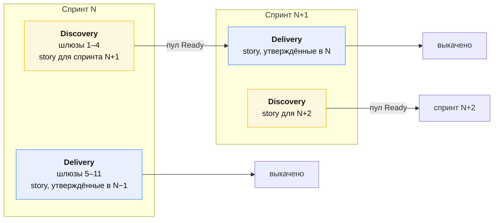

# Scrum-слой

[🇬🇧 English](./scrum.md) | 🇷🇺 Русский

[Пайплайн](./pipeline.ru.md) говорит, что должно быть правдой, чтобы работа
двинулась дальше. Эта страница говорит, **когда это происходит, кто в комнате и
как выглядит доска** — календарь и церемонии вокруг шлюзов.

Она существует, чтобы разрешить одну конкретную коллизию.

## Коллизия и её решение

Шлюз 4 говорит: **ни одной ветки до того, как дельта спецификации влита.**
Обычный однотрековый Scrum говорит: втяни story в спринт и закончи её в
спринте. Одновременно это невыполнимо. Если story описывается спецификацией и
строится в одном спринте, то либо спецификацию гонят, чтобы разблокировать
кодирование в среду, либо кодирование стартует до спецификации и метрика
падает — и происходит это каждый раз.

Поэтому решение не в дисциплине. Оно в **двух треках**: два параллельных трека
в каждом спринте, в одной команде, с теми же людьми в разные моменты.

**Discovery** (шлюзы 1–4) превращает намерение в утверждённую дельту. Владеют
тимлид, аналитик, тестировщик, техлид. Результат — **пул Ready**.

**Delivery** (шлюзы 5–11) превращает утверждённую дельту в прод. Владеют
разработчики и тестировщик. Вход — *только* пул Ready.

В delivery не входит ничего, что не вышло из discovery спринтом раньше. Одно
это правило делает шлюз 4 бесплатным: к моменту, когда разработчик берётся за
story, спецификация влита уже неделю, и «спека до кода» — не дисциплина,
которую надо помнить.

**Цена — один спринт задержки на первой story и ноль дальше**, потому что оба
трека идут в каждом спринте. Команды, отвергающие два трека, обычно думают, что
покупают спринт латентности; они покупают его один раз.

### Единственное исключение

Баг S1/S2 и хотфикс входят в delivery напрямую — у них
[нет дельты спецификации](./work-types.ru.md#баг). Это
[бюджет прерываний](#бюджет-прерываний), и он ограничен.

## Две доски

Один проект Jira, один бэклог, **две доски** над теми же задачами. Смотреть в
обе никому не нужно.

### Доска Discovery — доска тимлида

| Колонка | Шлюз | Карточка едет, когда | Кто двигает |
|---|---|---|---|
| `Intake` | 1 | задача создана и нарезана | тимлид |
| `Specifying` | 2 | аналитик взял в работу | аналитик |
| `Scenario review` | 3 | открыт PR с proposal | **автоматика** |
| `Spec approval` | 4 | тестировщик подтвердил PR | **автоматика** |
| `Ready` | — | PR с proposal влит в `main` | **автоматика** |

`Ready` — это пул. Единственная очередь в системе, которой позволено быть
длинной, и держать в ней стоит примерно **1,5 спринта работы**: достаточно,
чтобы delivery не голодал, и достаточно мало, чтобы спецификации не протухали
до того, как их кто-то построит.

### Доска Delivery — доска разработчиков

| Колонка | Шлюз | Карточка едет, когда | Кто двигает |
|---|---|---|---|
| `Ready` | — | (унаследовано из discovery) | — |
| `In progress` | 5–6 | запушена первая ветка с ключом | **автоматика** (Jira DevOps) |
| `In review` | 6 | открыт PR | **автоматика** |
| `Deployed to dev` | 7–8 | Argo сообщил, что релиз в dev | **автоматика** |
| `Verifying` | 9 | все task'и story в dev | **автоматика** (роллап) |
| `Ready to release` | 10 | тестировщик прошёл все сценарии | тестировщик |
| `Done` | 10–11 | подтверждена выкатка в прод | **автоматика** |

**Шесть переходов из восьми автоматизированы.** Разработчик не двигает карточки
вообще: пуш ветки, открытие PR и его влитие двигают карточку сами.
Тестировщик двигает ровно одну. Это намеренно: каждый ручной переход — это
статус, который к четвергу будет неверным.

Как связан каждый из них — в [каталоге автоматизации](./automation.ru.md).

### Статус story — роллап, его не проставляют

У Story с потомками **нет собственного статуса**. Автоматизация Jira его
выводит:

| Когда | Story становится |
|---|---|
| любой потомок пошёл в `In progress` | `In progress` |
| все потомки дошли до `Deployed to dev` | `Verifying` |
| тестировщик прошёл | `Ready to release` |
| все сервисы story в проде | `Done` |

Story никто не таскает. Если статус Story расходится с её Task'ами, сломано
правило, а не Task'и.

## Definition of Ready

Story может войти на доску delivery, только когда верно **всё** перечисленное.
Это DoR, и он механически проверяем — `/sdd:gate` его проверяет.

1. Тип задачи Story, метка `SDD`, записан `change-id`.
2. `proposal.md` + `specs/*.md` **влиты в `main`** (шлюз 4 пройден).
3. Тестировщик прошёл шлюз 3 — у каждого требования есть сценарии, включая
   несчастливые пути.
4. Затронутые репозитории известны, и на каждый есть Task.
5. Есть оценка.
6. Нет нерешённой зависимости от другой story, всё ещё сидящей в discovery.

Story, не выполнившая любой пункт, не втягивается «условно». Условные втяжки —
то, из-за чего пул Ready перестаёт что-либо значить.

## Definition of Done

Story готова, когда верно **всё** перечисленное, — а не когда код влит.

1. Каждый чекбокс в `tasks.md` — `[x]`.
2. Все PR влиты, CI зелёный, не осталось `TODO(PROJ-nnn)` на эту story.
3. Каждый сценарий из `specs/*.md` проверен на выкаченной системе (шлюз 9).
4. Изменение **работает в проде** во всех затронутых сервисах.
5. Fix Version проставлен на story и её task'ах и помечен Released.
6. Изменение OpenSpec заархивировано, основные спецификации обновлены (шлюз 11).
7. У feature-флагов, если они есть, заведён Task на снятие со сроком.

Четвёртый пункт — тот, который срезают. «Готово» в смысле «влито» — это ровно
то, из-за чего на демо показывают то, до чего не может дотянуться ни один
пользователь.

## Оценка

- **Story points только на Story.** Task'и — срезы по репозиториям и очков не
  несут: оценивать и то и другое значит считать дважды и обессмыслить velocity.
- **Оцениваем на груминге, теми, кто будет строить**, после того как дельта
  спецификации существует. Оценивать неописанную story — оценивать догадку.
- **Шкала относительная и короткая**: 1, 2, 3, 5, 8. **13 не бывает.** Story,
  которая ощущается на 13, провалила правило размера и является Epic'ом —
  оценка здесь работает датчиком дыма для плохой нарезки.
- **Работа discovery оценивается отдельно**, в собственных очках доски
  discovery, потому что это другие люди. Не смешивайте две velocity.
- **Баги оцениваются**; они съедают ту же ёмкость, что и всё прочее. Не
  оценивать баги — значит делать баговый спринт похожим на медленный.

Velocity — это **вход для планирования**, не цель и никогда не мера
производительности. Как только velocity уезжает наверх как оценка, оценки
раздуваются и число перестаёт годиться для планирования — то есть для
единственного, для чего оно было.

## Ёмкость и правило 20%

Делите ёмкость доставки каждого спринта заранее, до втягивания любой story:

| Доля | Размер | Владелец | На что |
|---|---|---|---|
| Доставка фич | **60%** | тимлид | story из пула Ready |
| Техдолг | **20%** | техлид | [полоса техдолга](./work-types.ru.md#техдолг) |
| Прерывания | **20%** | держится пустой | баги S1/S2, хотфиксы, эскалации |

**20% на техдолг — техлида, и защищать их по каждой story не нужно.** Работа с
долгом, которой приходится выигрывать приоритетный спор у фичи, проигрывает
всегда, в любой команде, вечно. Уберите спор со стола, забюджетировав долг.

**20% прерываний планируются пустыми.** Спринт, спланированный на 100%, — это
спринт, который падает при первой же икоте прода, и потом в этом обвиняют
оценки. Если спринт кончается с неистраченным бюджетом прерываний, втяните ещё
одну story из Ready в последнюю среду — но никогда не планируйте её в первый
день.

### Бюджет прерываний

Незапланированная работа входит в спринт по двум правилам:

1. **Только S1/S2**
   ([таблица severity](./work-types.ru.md#полосу-определяет-severity-а-не-церемония)).
   S3/S4 ждут следующего планирования, как и всё остальное.
2. **Когда бюджет истрачен, что-то выходит.** Тимлид называет выбрасываемую
   story, в спринте, публично. Молчаливый перебор — то, из-за чего команды
   перестают верить в объём спринта.

Отслеживайте трату прерываний как полноценное число на ретро. Три спринта
подряд с перебором — это не проблема ёмкости, а проблема качества, и лечится
она в доле техдолга.

## Церемонии

Двухнедельный спринт. Суммарная стоимость церемоний: **~4,5 часа на человека за
спринт**, около 5% ёмкости. Всё сверх этого должно себя оправдывать.

| Церемония | Когда | Длительность | Кто | Результат |
|---|---|---|---|---|
| [Груминг](#груминг) | ср. 1-й недели | 60 мин | вся команда | нарезанные, оценённые story |
| [Ревью спецификаций](#ревью-спецификаций) | чт., еженедельно | 30 мин | аналитик, тестировщик, техлид | пройдены шлюзы 3 и 4 |
| [Планирование](#планирование) | пн. 1-й недели | 60 мин | вся команда | объём спринта |
| [Стендап](#стендап) | ежедневно | 10 мин | команда доставки | названы блокеры |
| [Демо](#демо) | пт. 2-й недели | 45 мин | команда + стейкхолдеры | показана выкаченная работа |
| [Ретро](#ретро) | пт. 2-й недели | 45 мин | команда | одно изменение, один владелец |

### Груминг

**Самый ценный час спринта** и тот, который отменяют чаще всего. Здесь
применяется правило размера и здесь плохие story умирают дёшево.

Повестка, на story, ~10 минут:

1. Тимлид зачитывает намерение вслух. Если это больше двух предложений — это
   Epic.
2. **Применяем правило размера** — одно решение на ревью? один репозиторий или
   несколько?
3. Называем затронутые репозитории. Это и есть список task'ов; других не
   бывает.
4. Разработчики оценивают. **13 означает вернуться к шагу 2.**
5. Тестировщик называет самый рискованный сценарий. Если никто не может его
   назвать, story ещё не понята.

Грумим story **следующего** спринта, а не текущего. Груминг того, что вы
вот-вот начнёте, — это планирование; груминг того, что будете делать потом, —
это груминг.

### Ревью спецификаций

Тридцать минут в неделю, чтобы расчистить шлюзы 3 и 4. Это не встреча, чтобы
*делать* ревью — ревью происходит асинхронно в PR с proposal. Это слот, чтобы
**разблокировать застрявшие**: разногласия по контракту, неоднозначный
сценарий, proposal, три дня ждущий утверждающего.

Постоянное правило: **PR с proposal старше двух рабочих дней обсуждается здесь,
вслух.** Молчаливо блокирующийся discovery — тот режим отказа, который опустошит
пул Ready через два спринта, когда никто уже не вспомнит почему.

### Планирование

Короткое, потому что работа сделана на груминге. Если планирование затягивается
— груминг был пропущен.

1. Подтвердите ёмкость и три доли (60/20/20).
2. Тяните из пула Ready **в порядке приоритета**, пока не заполнена доля фич.
   Никаких споров о том, *что* значат story, — это был груминг.
3. Техлид называет работу с долгом на свои 20%.
4. **Ставьте контрактные task'и первыми.** У любой story, трогающей `common`
   или общий контракт, контрактный task планируется на первые дни, потому что
   [всё остальное в ней шлюзовано его публикацией](./jira-sdd-mapping.ru.md#шлюзование-контракта).
5. Оставьте долю прерываний пустой.

### Стендап

Десять минут, идём по доске **справа налево** — ближайшее к Done первым. Цель —
дозаканчивать, а не начинать, и чтение справа налево делает это поведением по
умолчанию.

Только три вещи: что заблокировано, где нужно решение, что протухло. Не статус —
доска автоматизирована и статус уже знает. Если кто-то пересказывает доску
вслух, значит автоматизация сломана, и поднимать надо именно это.

### Демо

Показ **с выкаченного окружения**, никогда с ноутбука. Если это нельзя показать
со staging или прода — оно не готово, и это находка.

Проходите по сценариям story, а не по коду. `specs/*.md` — это сценарий демо,
написанный до существования кода; в этот момент все вложения в SDD наглядно
окупаются.

### Ретро

Одно изменение, один владелец, один спринт. Ретро, породившее пять action
items, порождает ноль.

Постоянные цифры на стене, обсуждать не нужно, если не сдвинулись:

- Метрика SDD: прошедшие story / всего (`make check`)
- Истраченный бюджет прерываний
- Глубина пула Ready в спринтах
- Lead time, шлюз 4 → прод
- Change failure rate, выкатки → откаты

## Роли на языке Scrum

Роли этой команды ложатся на Scrum без изобретения новых:

| Здесь | Аналог в Scrum | Владеет в спринте |
|---|---|---|
| Тимлид | Product Owner + Scrum Master | порядок бэклога, размер, объём спринта, метрика |
| Техлид | технический авторитет | утверждение контрактов, 20% на долг |
| Аналитик | Product Owner (делегат) | содержимое пула Ready |
| Разработчик | Developer | доставка |
| Тестировщик | Developer (специализация QA) | качество сценариев, шлюз 9 |
| DevOps | Developer (специализация платформа) | пайплайн, промоушен, откат |

Отдельной роли Scrum Master нет. Если церемониям нужен фасилитатор на полную
ставку — они слишком тяжёлые: режьте их, а не нанимайте под них.

## Чего мы намеренно не делаем

- **Никаких отдельных «спринтов на спецификации».** Discovery идёт *внутри*
  каждого спринта. Спринт только на discovery означает голод доставки, а спринт
  только на доставку опустошает пул Ready.
- **Никакого переноса story «на 80% готовой».** Режьте по границе
  репозиториев, выкатывайте готовое, переоценивайте остаток. Перенос прячет
  провал нарезки, который его и вызвал.
- **Обязательство спринта — не обещание стейкхолдерам.** Это прогноз. Бюджет
  прерываний существует именно потому, что прогнозы встречаются с реальностью.
- **Никакого сравнения velocity между командами.** Очки калиброваны внутри
  команды и через границу не значат ничего.
- **Никаких статусных встреч.** [Доска автоматизирована](./automation.ru.md);
  если для знания статуса нужна встреча — чините автоматизацию.

## Смотрите также

| | |
|---|---|
| [Пайплайн](./pipeline.ru.md) | одиннадцать шлюзов |
| [Типы работ](./work-types.ru.md) | какую полосу берёт работа |
| [Релиз](./release.ru.md) | что происходит после `In review` |
| [Автоматизация](./automation.ru.md) | как связан каждый переход доски |
