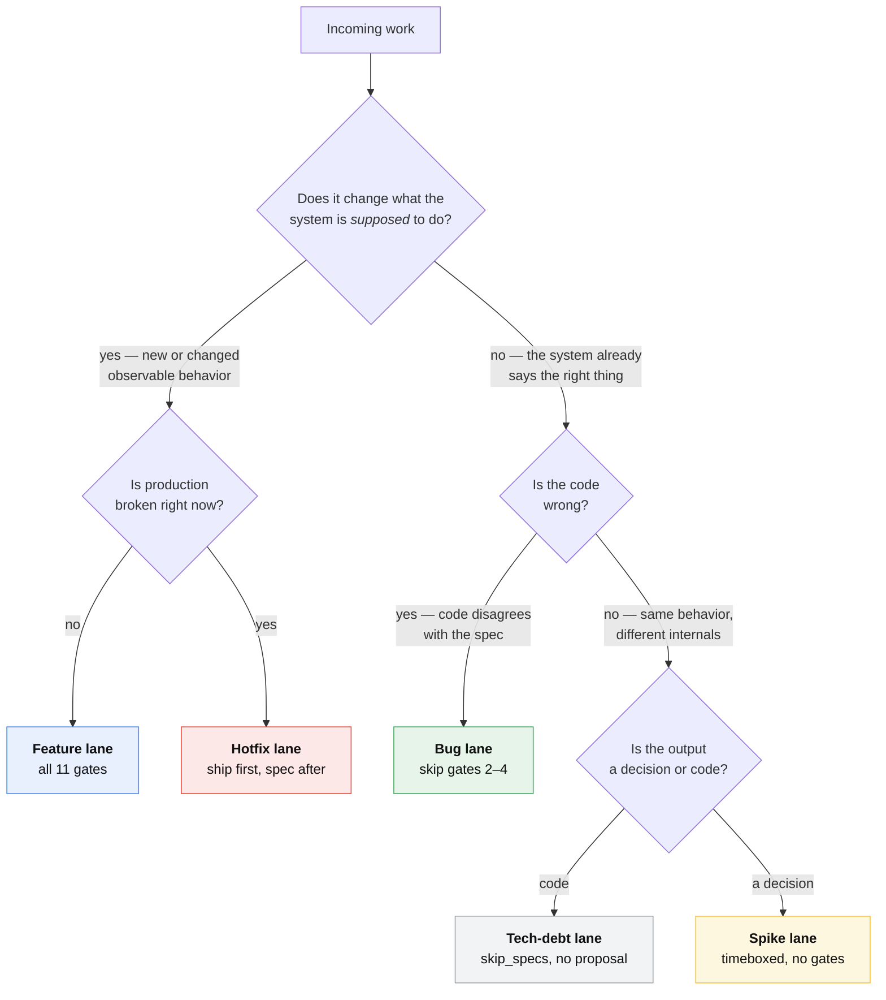
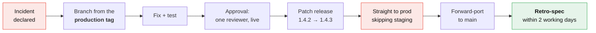

# Work types — the lane for everything

🇬🇧 English | [🇷🇺 Русский](./work-types.ru.md)

[The pipeline](./pipeline.md) describes one lane: a new capability, specced,
built, shipped. Most work is not that. This page routes **every** kind of work
onto the same eleven gates, and says exactly which gates a given lane skips and
why.

The rule that makes it a system rather than a pile of exceptions:

> **Every commit traces to a Jira key. Every Jira key has a type. Every type
> has a lane on this page. There is no "just a quick change".**

## The routing question

One question routes everything. Ask it before creating the issue.

> **Does this change what the system is supposed to do?**



## The routing table

| Work | Jira type | `SDD` label | Spec delta | Gates | Lane |
|---|---|---|---|---|---|
| New capability | Story | yes | new requirement | 1–11 | [Feature](#feature) |
| Change to existing behavior | Story | yes | modified requirement | 1–11 | [Feature](#feature) |
| Bug — code disagrees with spec | Bug | yes | **none** | 1, 5–11 | [Bug](#bug) |
| Bug — spec never covered the case | Bug | yes | added scenario | 1–11, expedited | [Bug](#bug) |
| Production incident | Incident + Bug | yes, retro | after the fact | [hotfix lane](#hotfix) | [Hotfix](#hotfix) |
| Refactor, tech debt, perf | Story | yes, `skip_specs` | none | 1, 5–11 | [Tech debt](#tech-debt) |
| Dependency bump | Task | no | none | automated | [Chore](#chore) |
| Build/CI/tooling change | Task | no | none | 5–11 | [Chore](#chore) |
| Infrastructure, nginx, scaling | Story or Task | only if observable | see lane | 1, 5–11 | [Infrastructure](#infrastructure) |
| Research, options, feasibility | Spike | no | none | timeboxed | [Spike](#spike) |
| Documentation | Task | no | none | 6 only | [Chore](#chore) |
| Experiment / A-B test | Story | yes | flagged requirement | 1–11 | [Experiment](#experiment) |
| Security patch (non-urgent) | Task | no | none | 5–11 | [Chore](#chore) |
| Security patch (exploitable) | Incident | yes, retro | after the fact | [hotfix lane](#hotfix) | [Hotfix](#hotfix) |

Only rows carrying the `SDD` label are counted by the
["story followed SDD" metric](./jira-sdd-mapping.md#the-metric). Chores and
spikes are deliberately outside it — a team that labels dependency bumps `SDD`
is gaming its own number.

---

## Feature

The default lane, fully described by [the pipeline](./pipeline.md). All eleven
gates, no shortcuts.

**Sizing** is the [team lead's triage rule](./jira-sdd-mapping.md#the-sizing-rule):
one review decision = one Story = one OpenSpec change; one repo = one Task =
one branch; too big = an Epic.

**The one thing that cannot be skipped:** gate 4. The spec delta is merged to
`main` before any branch is cut. Everything else in this lane is ordinary
engineering.

---

## Bug

A bug is, by definition, **code that disagrees with the spec**. The spec is
already correct — it says what should happen, and the system doesn't do it.
So there is nothing to propose and nothing to approve.

> **Do not write a spec delta to fix a bug.** Writing one means editing the
> spec to describe the broken behavior, or re-describing behavior the spec
> already covers. Both make the spec worse.

### Triage: two kinds of bug

Open the spec for the affected capability and look for the scenario.

| The spec… | What it means | What you do |
|---|---|---|
| **has** a scenario covering this case | ordinary bug — code is wrong | **Bug lane** below. No proposal, no gates 2–4. |
| **has no** scenario covering this case | spec gap — we never decided | **Feature lane**, expedited. The missing scenario is the change. |

The second row is not bureaucracy. If nobody ever decided what should happen
when the token expires mid-upload, then "fixing" it is a product decision
wearing a bug's clothes, and it needs the same one-paragraph proposal any other
decision gets. It is usually a fifteen-minute gate 2 and a same-day gate 4.

### The bug lane

```
Gate 1   Team lead    Bug issue, SDD label, change-id, severity, one Task per repo
Gate 2   —            skipped: the spec already says what should happen
Gate 3   —            skipped
Gate 4   —            skipped: nothing to approve
Gate 5   Developer    change dir with skip_specs, tasks.md with the repro as task 1
Gate 6   Developer    branch, failing test first, fix, PR
Gates 7–11              identical to the feature lane
```

Create the change directory with no `specs/`:

```yaml
# openspec/changes/fix-session-expiry/.openspec.yaml
schema: spec-driven
created: 2026-08-22
jira: PROJ-140
skip_specs: true      # bug: code disagrees with an existing spec, spec unchanged
```

And name the spec it violates, so the link survives:

```markdown
<!-- openspec/changes/fix-session-expiry/proposal.md -->
## Violated specification

`openspec/specs/auth/spec.md` → Requirement "Session lifetime"
→ Scenario "Session survives a page reload within 30 minutes".

Observed: session is dropped after ~4 minutes behind the CDN.
```

**`tasks.md` task 1.1 is always the failing test.** A bug fix that ships without
a test reproducing it is not a fix, it is a coincidence — and the spec scenario
it violates is already written for you, so the test has no design cost.

### Severity drives the lane, not the ceremony

| Severity | Meaning | Lane | Sprint treatment |
|---|---|---|---|
| S1 | production down or data at risk | [Hotfix](#hotfix) | interrupt, page |
| S2 | major function broken, no workaround | Bug lane | pull into the current sprint, top of the board |
| S3 | broken with a workaround | Bug lane | next sprint planning, normal |
| S4 | cosmetic | Bug lane | backlog, batched |

S1 and S2 are the only ones allowed to break sprint scope. See
[the Scrum layer](./scrum.md#the-interrupt-budget).

---

## Hotfix

Production is broken. The pipeline exists to make good decisions cheaply; when
the site is down the expensive thing is the outage. So this lane **inverts the
order**: ship, then spec.



**Rules, all of them non-negotiable:**

1. **Branch from the production tag, not from `main`.** `main` may contain
   unreleased work. `git switch -c PROJ-999-hotfix-token-leak backend-1.4.2`.
2. **Patch version only.** `backend-1.4.3`. A hotfix that needs a minor bump is
   not a hotfix, it is a feature being smuggled through the fast lane.
3. **One reviewer, synchronously.** Not "skip review" — review is what catches
   the second outage. Just do it live rather than asynchronously.
4. **Skip staging, not the tests.** The pipeline runs the full suite; only the
   promotion soak is skipped, and the deploy is announced in-channel.
5. **Forward-port to `main` the same day**, or the next release silently
   reverts the fix. CI must fail a release whose tag ancestry is missing a
   published hotfix tag.
6. **Retro-spec within two working days.** The incident revealed a behavior
   nobody had specified. A follow-up Story carries the spec delta through gates
   2–4 normally, and closing the incident requires it.

The retro-spec is what keeps this lane from becoming the default. If skipping
the spec merely deferred the work by two days, nobody skips the spec to go
faster.

### The incident issue

An Incident is not a Bug. The Incident tracks the *outage* — timeline, impact,
comms, postmortem. It has children:

```
Incident PROJ-999   "Checkout 500s, 14:02–14:41 UTC"
 ├─ Bug   PROJ-1000  [SDD]  the hotfix that stopped the bleeding
 ├─ Story PROJ-1001  [SDD]  retro-spec: what should happen on a token refresh race
 └─ Task  PROJ-1002         postmortem doc + action items
```

The Incident closes when all three close. That is the only enforcement
mechanism a hotfix lane needs.

---

## Tech debt

Refactors, performance work, migrations, test coverage, deleting dead code.
**No observable behavior changes** — that is the definition, and it is also the
acceptance criterion.

Gates 2–4 are skipped: there is no proposal, because nothing about the
product's behavior is being decided. But the story still gets a `change-id`,
still gets Jira-keyed `tasks.md` sections, and still counts for the metric —
because the discipline being measured is "planned before coded", and that
applies to a refactor exactly as much as to a feature.

```yaml
schema: spec-driven
created: 2026-08-22
jira: PROJ-150
skip_specs: true
```

**`design.md` is mandatory here**, and it is the whole value of the lane. It
answers: what is the current shape, what is the target shape, what is the
migration order, and how do we know behavior did not change. That last question
usually has one answer — *the existing spec scenarios still pass, unchanged* —
which is the payoff for having specs at all.

**If the refactor turns out to change behavior**, even slightly, even "nobody
depends on that", stop. It is a feature. Reopen at gate 1.

### Budget, not backlog

Tech debt does not compete with features in planning — it loses every time, in
every company that has ever tried it. Give it a fixed slice of sprint capacity
(we use **20%**), owned by the tech lead, and let the tech lead spend it
without arguing for it story by story. See
[capacity](./scrum.md#capacity-and-the-20-rule).

---

## Chore

Dependency bumps, CI tweaks, lint rules, documentation, log-level changes,
non-urgent security patches. **No `SDD` label, no change-id, no spec.** These
are Tasks, they carry a Jira key so the release notes can attribute them, and
that is all the ceremony they get.

**Most of them should not be human work at all:**

| Chore | Automated by | Human involvement |
|---|---|---|
| Dependency bumps | Renovate / Dependabot, grouped weekly | approve the PR |
| Security patches | Renovate, `security` label, opened immediately | approve, same day |
| Lockfile drift | CI, auto-committed | none |
| Formatting | pre-commit hook + CI | none |
| Changelog | generated from conventional commits at release | none |
| Release notes | generated from Jira Fix Version | none |

The rule: **if a chore recurs, automate it or stop doing it.** A chore that has
been done by hand three times is an automation story.

Renovate PRs are exempt from the branch-naming check by pattern (`renovate/*`),
which is the one exception `scripts/check-sdd.sh` makes and the only one it
should ever make.

---

## Infrastructure

Cluster config, nginx rules, scaling policy, secrets rotation, observability.
Route by the same question — **is the change observable to a user or to a
consuming service?**

| Change | Observable? | Treatment |
|---|---|---|
| Add a replica, tune HPA | no | Chore / Task in the gitops repo |
| Rotate a secret | no | Chore, on a schedule |
| Add a rate limit | **yes** — callers see 429s | Story, spec delta in `specifications` |
| Change a timeout users can hit | **yes** | Story, spec delta |
| Add a CDN cache header | **yes** — staleness is behavior | Story, spec delta |
| New dashboard or alert | no | Chore |

Rate limits, timeouts and cache policy are the three that teams reliably
misfile as "just infra". They are contracts: another team writes code against
them. They belong in the shared `specifications` store like any other contract.

`nginx` and the `gitops_*` repos are ordinary repos in this model — they get
tasks, branches and PRs with Jira keys, they just rarely carry spec deltas.

---

## Spike

A timeboxed investigation whose deliverable is **a decision, not code**.

- **Always timeboxed**, in the issue title: `[3d] Spike: evaluate Temporal vs. a
  cron table`.
- **Deliverable is written down** — an ADR, or an `/opsx:explore` session
  captured into the story. A spike whose output lives in someone's head has
  not been done.
- **No `SDD` label, no change-id, no spec delta.** A spike decides; the Story
  it spawns specs.
- **Code written during a spike is thrown away.** Not "cleaned up later" —
  thrown away. If it is worth keeping, the spike is over and the Story that
  keeps it goes through gate 1 like everything else.
- **The timebox is hard.** At expiry you report what you learned, even if the
  answer is "we still don't know". Extending a spike silently is how a
  two-day question becomes a two-sprint one.

Every spike closes by creating either a Story, an ADR, or a written "we decided
not to". Three outcomes, no fourth.

---

## Experiment

An A-B test or a flagged rollout is a feature whose spec has an extra clause:
the behavior is conditional on a flag, and **the flag's removal is part of the
work**.

```markdown
#### Scenario: Checkout with express-pay enabled

- **WHEN** the `express-pay` flag is on for the user
- **THEN** the express-pay button appears above the card form

#### Scenario: Checkout with express-pay disabled

- **WHEN** the `express-pay` flag is off
- **THEN** the checkout page is byte-identical to today's
```

The second scenario is the one people forget, and it is the one that makes the
experiment safe to ship on a Friday.

**Every flag gets an expiry.** The Story is not archived (gate 11) while the
flag is live; instead it spawns a mandatory follow-up Task —
*"remove the `express-pay` flag"* — due within two sprints, which carries the
final spec delta that deletes the conditional clause and states the winning
behavior flatly. A flag older than two sprints is tech debt with a countdown
already expired.

---

## What this taxonomy refuses to allow

- **"Quick change, no ticket."** There is no such lane. The cheapest lane is a
  Chore, which costs one Jira Task and no spec.
- **A Bug that quietly adds a requirement.** That is a spec gap; route it back
  through gates 2–4 (expedited).
- **A refactor that changes behavior.** That is a feature.
- **A hotfix that skips the retro-spec.** The Incident stays open until it
  lands, and open incidents are visible at every standup.
- **A spike that produces production code.** Throw it away and write the Story.
- **A permanent feature flag.** Every flag has a removal Task with a due date.

## See also

| | |
|---|---|
| [Pipeline](./pipeline.md) | the eleven gates in detail |
| [Scrum layer](./scrum.md) | how these lanes share a sprint, and the interrupt budget |
| [Release](./release.md) | how each lane reaches production |
| [Jira ↔ SDD mapping](./jira-sdd-mapping.md) | sizing, branch naming, the metric |
