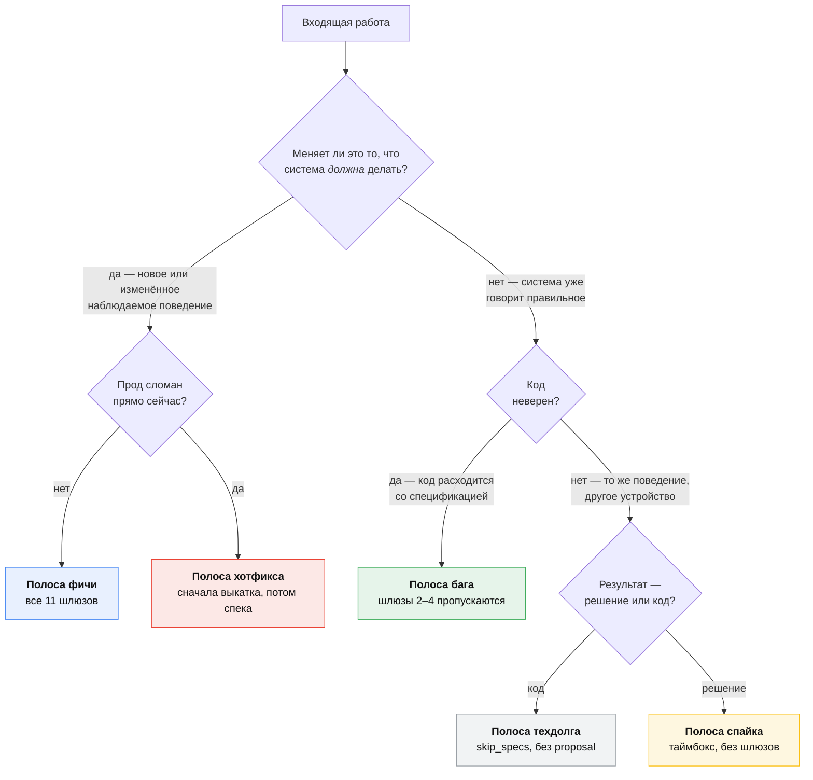
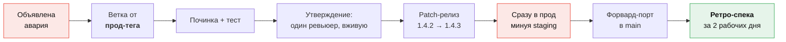

# Типы работ — полоса для всего

[🇬🇧 English](./work-types.md) | 🇷🇺 Русский

[Пайплайн](./pipeline.ru.md) описывает одну полосу: новая возможность,
описанная спецификацией, построенная и выкаченная. Большая часть работы — не
это. Эта страница направляет **любой** вид работы на те же одиннадцать шлюзов и
говорит, какие шлюзы конкретная полоса пропускает и почему.

Правило, которое делает из этого систему, а не кучу исключений:

> **Каждый коммит связан с ключом Jira. У каждого ключа есть тип. У каждого
> типа есть полоса на этой странице. «Просто быстрая правка» не существует.**

## Вопрос-маршрутизатор

Всё маршрутизирует один вопрос. Задайте его до создания задачи.

> **Меняет ли это то, что система *должна* делать?**



## Таблица маршрутизации

| Работа | Тип Jira | Метка `SDD` | Дельта спеки | Шлюзы | Полоса |
|---|---|---|---|---|---|
| Новая возможность | Story | да | новое требование | 1–11 | [Фича](#фича) |
| Изменение существующего поведения | Story | да | изменённое требование | 1–11 | [Фича](#фича) |
| Баг — код расходится со спекой | Bug | да | **нет** | 1, 5–11 | [Баг](#баг) |
| Баг — спека не покрывала случай | Bug | да | добавленный сценарий | 1–11, ускоренно | [Баг](#баг) |
| Авария на проде | Incident + Bug | да, задним числом | после факта | [полоса хотфикса](#хотфикс) | [Хотфикс](#хотфикс) |
| Рефакторинг, техдолг, производительность | Story | да, `skip_specs` | нет | 1, 5–11 | [Техдолг](#техдолг) |
| Бамп зависимости | Task | нет | нет | автоматически | [Рутина](#рутина) |
| Изменение сборки/CI/тулинга | Task | нет | нет | 5–11 | [Рутина](#рутина) |
| Инфраструктура, nginx, масштабирование | Story или Task | только если наблюдаемо | см. полосу | 1, 5–11 | [Инфраструктура](#инфраструктура) |
| Исследование, варианты, реализуемость | Spike | нет | нет | таймбокс | [Спайк](#спайк) |
| Документация | Task | нет | нет | только 6 | [Рутина](#рутина) |
| Эксперимент / A-B тест | Story | да | требование под флагом | 1–11 | [Эксперимент](#эксперимент) |
| Патч безопасности (несрочный) | Task | нет | нет | 5–11 | [Рутина](#рутина) |
| Патч безопасности (эксплуатируемый) | Incident | да, задним числом | после факта | [полоса хотфикса](#хотфикс) | [Хотфикс](#хотфикс) |

Метрика [«story followed SDD»](./jira-sdd-mapping.ru.md#метрика) считает только
строки с меткой `SDD`. Рутина и спайки намеренно вне её — команда, помечающая
`SDD` бампы зависимостей, накручивает собственное число.

---

## Фича

Полоса по умолчанию, полностью описанная в [пайплайне](./pipeline.ru.md). Все
одиннадцать шлюзов, без срезаний углов.

**Размер** — это [правило триажа тимлида](./jira-sdd-mapping.ru.md#правило-размера):
одно решение на ревью = одна Story = одно изменение OpenSpec; один репозиторий =
один Task = одна ветка; слишком большое = Epic.

**Единственное, что нельзя пропустить:** шлюз 4. Дельта спецификации влита в
`main` до того, как срезана хоть одна ветка. Всё остальное здесь — обычная
инженерия.

---

## Баг

Баг по определению — это **код, расходящийся со спецификацией**. Спецификация
уже верна: она говорит, что должно происходить, а система этого не делает.
Значит, предлагать нечего и утверждать нечего.

> **Не пишите дельту спецификации, чтобы починить баг.** Это означает либо
> править спеку под сломанное поведение, либо переописывать то, что спека уже
> покрывает. И то, и другое делает спецификацию хуже.

### Триаж: два вида бага

Откройте спецификацию затронутой возможности и поищите сценарий.

| В спецификации… | Что это значит | Что делаете |
|---|---|---|
| **есть** сценарий на этот случай | обычный баг — неверен код | **Полоса бага** ниже. Без proposal, без шлюзов 2–4. |
| **нет** сценария на этот случай | пробел в спеке — мы это не решали | **Полоса фичи**, ускоренно. Недостающий сценарий и есть изменение. |

Вторая строка — не бюрократия. Если никто никогда не решал, что должно
происходить при истечении токена посреди загрузки, то «починка» — это
продуктовое решение в костюме бага, и ему нужен такой же абзац proposal, как и
любому другому решению. Обычно это пятнадцать минут на шлюзе 2 и утверждение в
тот же день.

### Полоса бага

```
Шлюз 1   Тимлид         задача Bug, метка SDD, change-id, severity, по Task на репозиторий
Шлюз 2   —              пропуск: спека уже говорит, как должно быть
Шлюз 3   —              пропуск
Шлюз 4   —              пропуск: утверждать нечего
Шлюз 5   Разработчик    каталог изменения со skip_specs, tasks.md с репро задачей 1
Шлюз 6   Разработчик    ветка, сначала падающий тест, затем починка, PR
Шлюзы 7–11                идентичны полосе фичи
```

Создайте каталог изменения без `specs/`:

```yaml
# openspec/changes/fix-session-expiry/.openspec.yaml
schema: spec-driven
created: 2026-08-22
jira: PROJ-140
skip_specs: true      # баг: код расходится с существующей спекой, спека не меняется
```

И назовите нарушенную спецификацию, чтобы связь сохранилась:

```markdown
<!-- openspec/changes/fix-session-expiry/proposal.md -->
## Нарушенная спецификация

`openspec/specs/auth/spec.md` → требование «Session lifetime»
→ сценарий «Session survives a page reload within 30 minutes».

Наблюдается: сессия сбрасывается через ~4 минуты за CDN.
```

**Задача 1.1 в `tasks.md` — всегда падающий тест.** Починка бага без теста,
который его воспроизводит, — не починка, а совпадение; а нарушенный сценарий
спецификации уже написан за вас, так что тест не стоит ничего в проектировании.

### Полосу определяет severity, а не церемония

| Severity | Значение | Полоса | Что в спринте |
|---|---|---|---|
| S1 | прод лежит или данные под угрозой | [Хотфикс](#хотфикс) | прерывание, пейджер |
| S2 | важная функция сломана, обхода нет | Полоса бага | втягиваем в текущий спринт, наверх доски |
| S3 | сломано, но есть обход | Полоса бага | обычное планирование следующего спринта |
| S4 | косметика | Полоса бага | бэклог, пачкой |

Только S1 и S2 имеют право ломать объём спринта. См.
[бюджет прерываний](./scrum.ru.md#бюджет-прерываний).

---

## Хотфикс

Прод сломан. Пайплайн существует, чтобы дёшево принимать хорошие решения; когда
сайт лежит, дорого стоит именно простой. Поэтому эта полоса **инвертирует
порядок**: сначала выкатка, потом спецификация.



**Правила, все без исключения обязательные:**

1. **Ветка от прод-тега, не от `main`.** В `main` может быть невыпущенная
   работа. `git switch -c PROJ-999-hotfix-token-leak backend-1.4.2`.
2. **Только patch-версия.** `backend-1.4.3`. Хотфикс, которому нужен minor, —
   это не хотфикс, а фича, протаскиваемая по быстрой полосе.
3. **Один ревьюер, синхронно.** Не «без ревью» — ревью ловит вторую аварию.
   Просто вживую, а не асинхронно.
4. **Пропускается staging, но не тесты.** Пайплайн гоняет весь набор;
   пропускается только выдержка на промоушене, и выкатка объявляется в канале.
5. **Форвард-порт в `main` в тот же день**, иначе следующий релиз молча
   откатит починку. CI обязан ронять релиз, в предках тега которого нет
   опубликованного хотфикс-тега.
6. **Ретро-спека за два рабочих дня.** Авария вскрыла поведение, которое никто
   не описал. Отдельная Story проводит дельту спецификации через шлюзы 2–4
   нормально, и закрытие аварии требует её.

Ретро-спека — это то, что не даёт полосе стать полосой по умолчанию. Если
пропуск спецификации всего лишь откладывает работу на два дня, никто не
пропускает спецификацию ради скорости.

### Задача Incident

Incident — это не Bug. Incident отслеживает *аварию*: таймлайн, влияние,
коммуникацию, постмортем. У него есть потомки:

```
Incident PROJ-999   «Checkout отдаёт 500, 14:02–14:41 UTC»
 ├─ Bug   PROJ-1000  [SDD]  хотфикс, остановивший кровотечение
 ├─ Story PROJ-1001  [SDD]  ретро-спека: что должно происходить при гонке refresh
 └─ Task  PROJ-1002         постмортем + action items
```

Incident закрывается, когда закрыты все трое. Это единственный механизм
принуждения, который нужен полосе хотфикса.

---

## Техдолг

Рефакторинги, производительность, миграции, покрытие тестами, удаление мёртвого
кода. **Наблюдаемое поведение не меняется** — это и определение, и критерий
приёмки.

Шлюзы 2–4 пропускаются: proposal нет, потому что ничего о поведении продукта не
решается. Но story всё равно получает `change-id`, всё равно получает секции
`tasks.md` с ключами Jira и всё равно считается в метрике — потому что
измеряемая дисциплина это «сначала спланировано, потом закодировано», и к
рефакторингу она применима ровно так же, как к фиче.

```yaml
schema: spec-driven
created: 2026-08-22
jira: PROJ-150
skip_specs: true
```

**`design.md` здесь обязателен**, и в нём вся ценность полосы. Он отвечает:
какая форма сейчас, какая целевая, каков порядок миграции и откуда мы знаем,
что поведение не изменилось. У последнего вопроса обычно один ответ —
*существующие сценарии спецификации проходят без изменений* — и это окупаемость
самого наличия спецификаций.

**Если рефакторинг всё-таки меняет поведение**, пусть немного, пусть «на это
никто не завязан», — стоп. Это фича. Начинайте со шлюза 1.

### Бюджет, а не бэклог

Техдолг не конкурирует с фичами в планировании — он проигрывает всегда, в любой
компании, которая это пробовала. Дайте ему фиксированную долю ёмкости спринта
(у нас **20%**), владельцем сделайте техлида и позвольте тратить её, не
защищая каждую story отдельно. См. [ёмкость](./scrum.ru.md#ёмкость-и-правило-20).

---

## Рутина

Бампы зависимостей, правки CI, правила линтера, документация, уровни логов,
несрочные патчи безопасности. **Без метки `SDD`, без change-id, без
спецификации.** Это Task'и, у них есть ключ Jira, чтобы release notes могли их
атрибутировать, и это вся положенная им церемония.

**Большая часть из этого вообще не должна быть человеческой работой:**

| Рутина | Кем автоматизировано | Участие человека |
|---|---|---|
| Бампы зависимостей | Renovate / Dependabot, пачкой раз в неделю | подтвердить PR |
| Патчи безопасности | Renovate, метка `security`, сразу | подтвердить в тот же день |
| Расхождение lock-файла | CI, коммитит сам | нет |
| Форматирование | pre-commit хук + CI | нет |
| Changelog | генерируется из conventional commits на релизе | нет |
| Release notes | генерируется из Fix Version в Jira | нет |

Правило: **если рутина повторяется — автоматизируйте её или перестаньте её
делать.** Рутина, сделанная руками трижды, — это story про автоматизацию.

PR'ы Renovate исключены из проверки имени ветки по шаблону (`renovate/*`) — это
единственное исключение, которое делает `scripts/check-sdd.sh`, и единственное,
которое он когда-либо должен делать.

---

## Инфраструктура

Конфигурация кластера, правила nginx, политика масштабирования, ротация
секретов, наблюдаемость. Маршрутизируется тем же вопросом — **наблюдаемо ли
изменение для пользователя или для потребляющего сервиса?**

| Изменение | Наблюдаемо? | Обработка |
|---|---|---|
| Добавить реплику, настроить HPA | нет | Рутина / Task в gitops-репозитории |
| Ротировать секрет | нет | Рутина, по расписанию |
| Добавить rate limit | **да** — вызывающие видят 429 | Story, дельта в `specifications` |
| Изменить таймаут, до которого пользователи дотягиваются | **да** | Story, дельта спецификации |
| Добавить CDN cache header | **да** — устаревание это поведение | Story, дельта спецификации |
| Новый дашборд или алерт | нет | Рутина |

Rate limit, таймауты и политика кеширования — три вещи, которые команды
стабильно записывают в «просто инфру». Это контракты: другая команда пишет код
против них. Им место в общем хранилище `specifications`, как любому контракту.

`nginx` и репозитории `gitops_*` в этой модели — обычные репозитории: у них
есть задачи, ветки и PR с ключами Jira, просто дельты спецификаций у них
бывают редко.

---

## Спайк

Ограниченное по времени исследование, результат которого — **решение, а не
код**.

- **Всегда с таймбоксом**, прямо в заголовке задачи:
  `[3d] Spike: сравнить Temporal и таблицу cron`.
- **Результат записан** — ADR или сессия `/opsx:explore`, зафиксированная в
  задаче. Спайк, результат которого живёт у кого-то в голове, не сделан.
- **Без метки `SDD`, без change-id, без дельты.** Спайк решает; Story, которую
  он породил, описывает спецификацией.
- **Код, написанный во время спайка, выбрасывается.** Не «потом причешем» —
  выбрасывается. Если его стоит сохранить, спайк окончен, и Story, которая его
  сохраняет, проходит шлюз 1, как всё остальное.
- **Таймбокс жёсткий.** По истечении вы докладываете, что узнали, даже если
  ответ «мы всё ещё не знаем». Молчаливое продление — то, как двухдневный
  вопрос становится двухспринтовым.

Каждый спайк закрывается созданием либо Story, либо ADR, либо записанного «мы
решили не делать». Три исхода, четвёртого нет.

---

## Эксперимент

A-B тест или выкатка под флагом — это фича, у спецификации которой есть лишняя
оговорка: поведение зависит от флага, и **снятие флага входит в работу**.

```markdown
#### Scenario: Checkout with express-pay enabled

- **WHEN** the `express-pay` flag is on for the user
- **THEN** the express-pay button appears above the card form

#### Scenario: Checkout with express-pay disabled

- **WHEN** the `express-pay` flag is off
- **THEN** the checkout page is byte-identical to today's
```

Второй сценарий как раз тот, о котором забывают, и именно он делает эксперимент
безопасным для выкатки в пятницу.

**У каждого флага есть срок.** Story не архивируется (шлюз 11), пока флаг жив;
вместо этого она порождает обязательный Task — *«снять флаг `express-pay`»* — со
сроком в два спринта, который несёт финальную дельту: удаляет условную оговорку
и объявляет победившее поведение прямо. Флаг старше двух спринтов — это техдолг
с уже истёкшим отсчётом.

---

## Что эта таксономия запрещает

- **«Быстрая правка без тикета».** Такой полосы нет. Самая дешёвая полоса —
  Рутина, и она стоит одного Task в Jira и нуля спецификаций.
- **Bug, который втихую добавляет требование.** Это пробел в спеке; верните его
  через шлюзы 2–4 (ускоренно).
- **Рефакторинг, меняющий поведение.** Это фича.
- **Хотфикс без ретро-спеки.** Incident остаётся открытым, пока она не влита, а
  открытые аварии видны на каждом стендапе.
- **Спайк, порождающий продовый код.** Выбросьте и напишите Story.
- **Вечный feature flag.** У каждого флага есть Task на снятие со сроком.

## Смотрите также

| | |
|---|---|
| [Пайплайн](./pipeline.ru.md) | одиннадцать шлюзов подробно |
| [Scrum-слой](./scrum.ru.md) | как эти полосы делят спринт и бюджет прерываний |
| [Релиз](./release.ru.md) | как каждая полоса доезжает до прода |
| [Связка Jira ↔ SDD](./jira-sdd-mapping.ru.md) | размер, имена веток, метрика |
